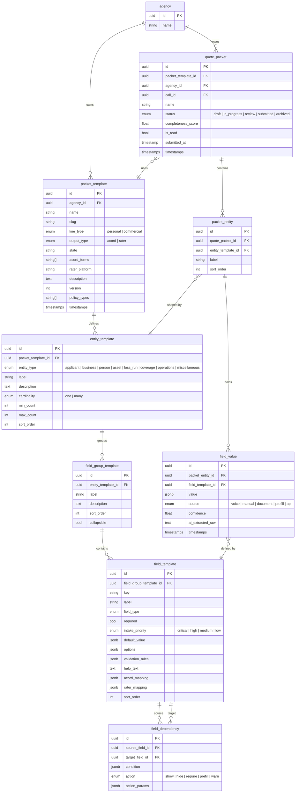

# ADR-001: Quote Packet Data Model V1

| Field        | Value                          |
|--------------|--------------------------------|
| **Status**   | Proposed                       |
| **Date**     | 2026-02-08                     |
| **Author**   | Alex                           |
| **Reviewers**| Raghav, Martin, Mike           |

---

## 1. Context & Problem Statement

Our product captures rich insurance data through voice calls, forms, and document uploads. Today, that data has no structured home. Agents need to take collected information and **submit it** to carriers via two primary channels:

1. **ACORD forms** (commercial lines) - standardized PDF applications (125, 126, 130, etc.)
2. **Rater platforms** (personal lines) - web-based comparative rating tools (PLRater, EZLynx, TurboRater, etc.)

We need a **flexible, template-driven data model** that can:
- Represent any insurance submission type (Workers Comp, Personal Auto, Home, GL, etc.)
- Define which fields, entities, and rules apply to each specific use case
- Store actual submission data as agents build a packet
- Map stored data to output formats (ACORD field coordinates, rater screen fields)
- Support AI-powered intake (prefill from voice, flag missing fields, suggest values)

### Guiding Use Cases

| Use Case | Line | Output | Template Name |
|----------|------|--------|---------------|
| California Workers' Compensation (Contractor) | Commercial | ACORD 125 + 130 | `ca_workers_comp` |
| Personal Auto Quote | Personal | PLRater | `plrater_auto` |
| Homeowners Quote | Personal | PLRater | `plrater_home` |

### System Flow

```
                                                    ┌──────────┐
                                                    │  ACORD   │
                                                    │  PDF     │
┌──────────────┐   ┌──────────────┐   ┌──────────┐  ├──────────┤
│ Existing Info│──>│   Packet     │──>│  Packet  │─>│  Rater   │
│ (Voice/Docs) │   │  Management  │   │  Model   │  │  Export  │
└──────────────┘   └──────────────┘   └──────────┘  ├──────────┤
                                                    │ (Carrier │
                                                    │ Portals) │
                                                    └──────────┘
```

---

## 2. Decision: Template + Instance Architecture

The data model is split into two sides:

- **Template side** defines the *blueprint* for a specific insurance use case: what entities exist, what fields they contain, what rules apply, how fields map to outputs.
- **Instance side** stores the *actual data* for a specific submission: the real values an agent has collected for a real client.

This is analogous to **Class vs. Object** in programming, or **Schema vs. Row** in databases.

```
┌─────────────────────────────────┐      ┌─────────────────────────────────┐
│         TEMPLATE SIDE           │      │         INSTANCE SIDE           │
│         (the blueprint)         │      │         (the actual data)       │
│                                 │      │                                 │
│  packet_template (→ agency)     │      │  quote_packet (→ agency)        │
│    └─ entity_template[]         │──┐   │    └─ packet_entity[]           │
│        └─ field_group_template[]│  │   │        └─ field_value[]         │
│            └─ field_template[]  │  │   │                                 │
│                                 │  │   │                                 │
│  field_dependency               │  └──>│  (each instance references its  │
│  (cross-field rules)            │      │   corresponding template)       │
└─────────────────────────────────┘      └─────────────────────────────────┘
```

---

## 3. Entity-Relationship Diagram



---

## 4. Template-Side Models (Detail)

### 4.1 `packet_template`

The top-level blueprint. One per use case (e.g., "CA Workers Comp", "PLRater Auto").

| Column | Type | Required | Description |
|--------|------|----------|-------------|
| `id` | uuid | yes | Primary key |
| `agency_id` | uuid FK | yes | Owning agency. Templates are scoped to agencies. |
| `name` | string | yes | Human label, e.g. "California Workers' Compensation" |
| `slug` | string | yes | Machine key, e.g. `ca_workers_comp`. Unique per agency. |
| `line_type` | enum | yes | `personal` or `commercial` |
| `output_type` | enum | yes | `acord` or `rater` |
| `state` | string | no | State code if state-specific, e.g. "CA" |
| `acord_forms` | string[] | no | ACORD form numbers, e.g. `["125", "130"]` |
| `rater_platform` | string | no | Rater name, e.g. "PLRater", "EZLynx" |
| `description` | text | no | What this template covers |
| `version` | int | yes | Schema version for migrations |
| `is_active` | bool | yes | Whether available for new packets |
| `policy_types` | string[] | no | Array of policy type identifiers for lead matching (values from `ALL_POLICY_TYPES`) |

### 4.2 `entity_template`

Defines a data section within a template. Each entity type has a specific role and cardinality.

| Column | Type | Required | Description |
|--------|------|----------|-------------|
| `id` | uuid | yes | Primary key |
| `packet_template_id` | uuid FK | yes | Parent template |
| `entity_type` | enum | yes | See Entity Type System below |
| `label` | string | yes | UI display name, e.g. "Officers & Owners" |
| `description` | text | no | Help text for this section |
| `cardinality` | enum | yes | `one` (singleton) or `many` (repeating) |
| `min_count` | int | yes | Minimum instances required (default 0; 1 for required singletons) |
| `max_count` | int | no | Maximum instances allowed (null = unlimited) |
| `sort_order` | int | yes | Display order in sidebar/UI |

### 4.3 `field_group_template`

Groups related fields within an entity for UI organization (collapsible sections, visual cards).

| Column | Type | Required | Description |
|--------|------|----------|-------------|
| `id` | uuid | yes | Primary key |
| `entity_template_id` | uuid FK | yes | Parent entity template |
| `label` | string | yes | Group heading, e.g. "Primary Contact" |
| `description` | text | no | Help text |
| `sort_order` | int | yes | Display order within entity |
| `collapsible` | bool | yes | Whether UI can collapse this group (default true) |

### 4.4 `field_template`

The individual field definition. This is the core of the system.

| Column | Type | Required | Description |
|--------|------|----------|-------------|
| `id` | uuid | yes | Primary key |
| `field_group_template_id` | uuid FK | yes | Parent field group |
| `key` | string | yes | Machine key, unique within template. e.g. `business_phone` |
| `label` | string | yes | Display label, e.g. "Business Phone" |
| `field_type` | enum | yes | See Field Type System below |
| `required` | bool | yes | Whether field must have a value for submission |
| `intake_priority` | enum | yes | AI intake importance: `critical`, `high`, `medium`, `low` |
| `default_value` | jsonb | no | Pre-filled value, e.g. `"No"` for boolean questions |
| `options` | jsonb | no | For select/multi_select: `[{value, label}]` |
| `validation_rules` | jsonb | no | e.g. `{min_length: 9, max_length: 9, pattern: "^\\d+$"}` for FEIN |
| `help_text` | text | no | Guidance for user or AI on how to fill this field |
| `acord_mapping` | jsonb | no | `{form: "125", section: "applicant", field_id: "BusinessPhone"}` |
| `rater_mapping` | jsonb | no | `{platform: "PLRater", screen: "client_info", field_id: "phone"}` |
| `sort_order` | int | yes | Display order within group |

### 4.5 `field_dependency`

Rules connecting fields. When a source field meets a condition, an action is applied to the target field.

| Column | Type | Required | Description |
|--------|------|----------|-------------|
| `id` | uuid | yes | Primary key |
| `source_field_id` | uuid FK | yes | The triggering field |
| `target_field_id` | uuid FK | yes | The affected field |
| `condition` | jsonb | yes | e.g. `{operator: "equals", value: true}` or `{operator: "gt", value: 0}` |
| `action` | enum | yes | `show`, `hide`, `require`, `prefill`, `warn` |
| `action_params` | jsonb | no | e.g. for warn: `{message: "Explain in Remarks"}` |

**Supported condition operators:** `equals`, `not_equals`, `gt`, `lt`, `gte`, `lte`, `contains`, `is_empty`, `is_not_empty`

**Supported actions:**
| Action | Effect |
|--------|--------|
| `show` | Make target field visible (was hidden) |
| `hide` | Hide target field |
| `require` | Make target field required |
| `prefill` | Set target field to a value from `action_params.value` |
| `warn` | Display a warning message from `action_params.message` |

---

## 5. Instance-Side Models (Detail)

### 5.1 `quote_packet`

An actual submission being worked on by an agent.

| Column | Type | Required | Description |
|--------|------|----------|-------------|
| `id` | uuid | yes | Primary key |
| `packet_template_id` | uuid FK | yes | Which template this packet follows |
| `agency_id` | uuid FK | yes | Owning agency. Follows the existing `agencyId` FK pattern used by customers, locations, etc. |
| `call_id` | uuid FK | no | Associated voice call (source of initial data) |
| `name` | string | yes | Display name, e.g. "Rodriguez LLC - WC Renewal" |
| `status` | enum | yes | `draft`, `in_progress`, `review`, `submitted`, `archived` |
| `completeness_score` | float | no | Calculated 0-100 based on required fields filled |
| `is_read` | bool | yes | Read/unread status for inbox-style tracking (default false) |
| `submitted_at` | timestamp | no | Timestamp of when the packet was submitted; null until submission occurs |
| `created_at` | timestamp | yes | |
| `updated_at` | timestamp | yes | |

### 5.2 `packet_entity`

A concrete instance of an entity within a packet. For `cardinality: one` entities, exactly one is auto-created. For `cardinality: many`, the user adds instances (e.g., adding a driver, a vehicle, a loss year).

| Column | Type | Required | Description |
|--------|------|----------|-------------|
| `id` | uuid | yes | Primary key |
| `quote_packet_id` | uuid FK | yes | Parent packet |
| `entity_template_id` | uuid FK | yes | Which entity template this instantiates |
| `label` | string | no | User-assigned label, e.g. "John Smith" or "2019 Toyota Camry" |
| `sort_order` | int | yes | Display order among siblings of same type |

### 5.3 `field_value`

The actual data value for a single field on a single entity instance.

| Column | Type | Required | Description |
|--------|------|----------|-------------|
| `id` | uuid | yes | Primary key |
| `packet_entity_id` | uuid FK | yes | Parent entity instance |
| `field_template_id` | uuid FK | yes | Which field this value is for |
| `value` | jsonb | no | The actual value (null = not yet filled) |
| `source` | enum | yes | How this value was populated |
| `confidence` | float | no | AI confidence 0.0-1.0 (null if manual) |
| `ai_extracted_raw` | text | no | Original text the AI extracted from (for auditability) |
| `created_at` | timestamp | yes | |
| `updated_at` | timestamp | yes | |

**Source enum values:**
| Source | Meaning |
|--------|---------|
| `voice` | Extracted from voice call transcript by AI |
| `manual` | Typed by user in the form UI |
| `document` | Parsed from uploaded document (dec page, loss run PDF, etc.) |
| `prefill` | Auto-filled from template default or field dependency rule |
| `api` | Pulled from external API (e.g., FEIN lookup, VIN decoder) |

---

## 6. Entity Type System

The `entity_type` enum defines the semantic role of each data section. Templates select which entity types they need and configure them with the right fields.

| Entity Type | Cardinality | Description | Commercial | Personal |
|-------------|-------------|-------------|:----------:|:--------:|
| `applicant` | one | The named insured / policyholder. Contact info, legal identity, addresses. | Yes | Yes |
| `business` | one | Business operational details: nature of operations, industry codes, subcontractor info. | Yes | -- |
| `person` | many | Additional people: drivers, officers/owners, additional insureds, household members. | Yes | Yes |
| `asset` | many | Insurable things: vehicles, properties, job-site locations, WC class-code entries. | Yes | Yes |
| `loss_run` | many | Prior insurance & claims history: one instance per policy year. Carrier, premium, claims summary. | Yes | Yes |
| `coverage` | one | Coverage selections and policy parameters: limits, deductibles, effective dates, experience mod. | Yes | Yes |
| `operations` | one | Underwriting questions, safety programs, exposure details. Primarily commercial. | Yes | -- |
| `miscellaneous` | one | Catch-all for data that doesn't fit other entity types. Used for carrier-specific "Company Questions," supplemental forms, or other ad-hoc fields per template. | Yes | Yes |

### Entity composition per template type:

```
CA Workers Comp (Commercial / ACORD)
├── applicant (one)    ── contact, legal entity, addresses
├── business (one)     ── operations detail, subcontractors, licensing
├── person (many)      ── officers & owners
├── asset (many)       ── locations + WC class codes w/ payroll
├── loss_run (many)    ── prior carriers + claims per year
├── coverage (one)     ── policy term, limits, experience mod
└── operations (one)   ── underwriting questions, safety programs

PLRater Auto (Personal / Rater)
├── applicant (one)    ── personal info, contact, address
├── person (many)      ── drivers
├── asset (many)       ── vehicles (with per-vehicle coverage)
├── loss_run (many)    ── incidents & violations
└── coverage (one)     ── liability limits, UM/UIM, PIP

PLRater Home (Personal / Rater)
├── applicant (one)    ── personal info, contact, address
├── asset (one*)       ── property details, systems, features, protections
├── loss_run (many)    ── prior claims
└── coverage (one)     ── dwelling, liability, deductibles, endorsements

 * Home asset is technically cardinality=many but min_count=1, max_count=1 for single-property V1
```

---

## 7. Field Type System

| Field Type | JSON Value Format | Example |
|------------|-------------------|---------|
| `text` | `"string value"` | `"Acme Construction LLC"` |
| `textarea` | `"long string..."` | `"Plumbing contractor, residential..."` |
| `number` | `123` | `15` (years in business) |
| `currency` | `125000.00` | `125000.00` (annual payroll) |
| `percentage` | `0.85` | `0.85` (experience mod) |
| `date` | `"2026-06-01"` | `"2026-06-01"` (effective date) |
| `boolean` | `true` / `false` | `false` (uses subcontractors?) |
| `select` | `"option_value"` | `"llc"` (entity type) |
| `multi_select` | `["val1","val2"]` | `["wind","fire"]` (claim types) |
| `phone` | `"5551234567"` | `"5551234567"` |
| `email` | `"a@b.com"` | `"agent@agency.com"` |
| `ein` | `"123456789"` | `"123456789"` (9-digit FEIN) |
| `ssn` | `"123456789"` | `"123456789"` |
| `address` | `{street, city, state, zip}` | `{street: "123 Main", city: "LA", state: "CA", zip: "90001"}` |
| `vin` | `"JTDKN3DU5A0..."` | 17-character VIN |

---

## 8. Intake Priority Tiers & Multi-Entity Considerations

### Purpose

The existing `intake_priority` column (`critical`, `high`, `medium`, `low`) doubles as the display-tier control for the Custom Portal. Fields with `intake_priority = "critical"` are treated as **primary** (shown first); all other priorities (`high`, `medium`, `low`) are treated as **secondary** (follow-on, shown after the primary step). No additional column is needed.

### Multi-entity behavior (future Custom Portal)

When a primary field belongs to a multi-entity (e.g., Driver `cardinality: "many"`), the Custom Portal must:

1. **Render primary fields per-instance.** Each entity instance (e.g., each driver) gets its own card showing only `critical` fields for that entity. The first instance is pre-created; additional instances are added via "Add another driver/vehicle" buttons.
2. **Support adding instances before secondary fields.** The customer should be able to add all entity instances (all drivers, all vehicles) with just their critical fields *before* being prompted for secondary fields. This keeps the initial form short and avoids front-loading dozens of fields.
3. **Secondary fields are shown per-instance after primary submission.** Once critical fields for all entities are submitted, remaining fields are presented grouped by entity instance (e.g., "Tell us more about Driver 1: John Smith" with occupation, gender, relationship fields).
4. **Entity-level completeness is tracked separately.** The completeness calculation should consider that a multi-entity's critical fields must be filled per-instance (e.g., each driver needs Name + DOB + DL#), not just once.

### Example — Auto quote with 2 drivers

```
Step 1 (Primary — intake_priority = "critical"):
├── Applicant: Name, DOB, Address, Phone, Email
├── Driver 1: Name, DOB, DL#
├── [+ Add another driver]
├── Driver 2: Name, DOB, DL#
├── Vehicle 1: Year/Make/Model
├── [+ Add another vehicle]
└── [Submit primary fields]

Step 2 (Secondary — intake_priority = "high" | "medium" | "low"):
├── Applicant: Marital Status, Own/Rent, SSN
├── Driver 1: Occupation, Gender, Relationship, College?
├── Driver 2: Occupation, Gender, Relationship, College?
├── Vehicle 1: VIN, Usage, Mileage, Garaging Address
├── Prior Coverage: Carrier, Expiration, Duration
├── History: Accidents/Violations
└── Coverage: Desired Limits
```

### Determination logic (for Custom Portal implementation)

```
For each entity_template in packet:
  if entity.cardinality == "many":
    for each instance of this entity:
      render fields where intake_priority == "critical"
      show "Add another {entity.label}" button (if under max_count)
  else:
    render fields where intake_priority == "critical"
```

---

## 9. Handling Loss Runs

Loss runs deserve special attention because they sit at the intersection of **structured data** and **document storage**.

### Structured Side (V1)

Loss runs are modeled as `entity_type: loss_run` with `cardinality: many`. Each instance represents **one prior policy year** and contains fields like:

- `carrier_name`, `policy_number`, `policy_period_start`, `policy_period_end`
- `annual_premium`, `total_claims_count`, `total_incurred`, `valuation_date`
- `loss_run_attached` (boolean - is a PDF attached?)

This gives us queryable, structured loss history data that maps to ACORD 125/130's "Prior Carrier Information" and "Loss History" sections.

### Document Side (V1)

Loss runs are often PDF documents from prior carriers. We use a `packet_attachment` table that references the `uploads` table for file storage via S3 presigned URLs.

**Storage pattern:**
- Files are uploaded via the `uploads` table flow (S3 presigned URLs)
- `packet_attachments` references the upload via `upload_id` FK — no file metadata duplication
- File metadata (name, size, content type, S3 key) lives in the `uploads` table

| Column | Type | Required | Description |
|--------|------|----------|-------------|
| `id` | uuid | yes | Primary key |
| `quote_packet_id` | uuid FK | yes | Parent packet |
| `packet_entity_id` | uuid FK | no | Optional link to specific loss_run entity instance |
| `upload_id` | uuid FK | yes | Reference to `uploads` table (holds file name, S3 key, content type, size) |
| `attachment_type` | enum | yes | `loss_run`, `supplement`, `mod_worksheet`, `dec_page`, `other` |
| `parsed_data` | jsonb | no | AI-extracted structured data (future) |
| `created_at` | timestamp | yes | |

This keeps document handling separate from the core field model while allowing us to associate PDFs with their corresponding structured loss_run entities. In a future iteration, AI can parse uploaded loss run PDFs and auto-populate the structured `loss_run` entity fields.

### Incidents (Personal Lines Variant)

For personal lines, loss runs map to **incidents**: accidents, violations, and claims. These use the same `loss_run` entity type but with different field templates (e.g., `date_of_incident`, `incident_type`, `at_fault`, `driver_name`).

---

## 10. Example Template: CA Workers' Compensation

**`packet_template`:**

| Field | Value |
|-------|-------|
| name | California Workers' Compensation |
| slug | `ca_workers_comp` |
| line_type | `commercial` |
| output_type | `acord` |
| state | CA |
| acord_forms | `["125", "130"]` |
| description | Full WC submission for California, including contractor supplemental fields. |

### Entity & Field Map

#### 10.1 `applicant` (one) - "Applicant & Business Info"

Sidebar label: **Applicant & Business** (displayed merged with `business` entity in UI)

| Field Group | Key | Label | Type | Req | Priority | ACORD Mapping |
|-------------|-----|-------|------|:---:|----------|---------------|
| **Primary Contact** | | | | | | |
| | `business_phone` | Business Phone | phone | yes | critical | 125.ApplicantPhone |
| | `email` | Email | email | yes | critical | 125.ApplicantEmail |
| | `website` | Website | text | no | low | 125.Website |
| | `contact_name` | Contact Name | text | yes | high | 125.ContactName |
| **Legal Entity** | | | | | | |
| | `name_insured` | Name Insured | text | yes | critical | 125.NameInsured |
| | `fein` | Federal Employer ID (FEIN) | ein | yes | critical | 125.FEIN |
| | `entity_type` | Entity Type | select | yes | high | 125.EntityType |
| | | *Options:* `corporation`, `llc`, `partnership`, `sole_proprietor`, `joint_venture`, `other` | | | | |
| | `date_business_started` | Date Business Started | date | yes | high | 125.DateBusinessStarted |
| | `description_of_operations` | Describe Your Business Operations | textarea | yes | critical | 125.DescriptionOfOperations |
| | `naics_sic_code` | NAICS/SIC Code | text | yes | high | 125.NAICSSICCode |
| **Addresses** | | | | | | |
| | `mailing_address` | Mailing Address | address | yes | critical | 125.MailingAddress |
| | `location_is_different` | Primary business location is different | boolean | no | medium | -- |
| | `primary_location` | Primary Business Location | address | no | medium | 125.LocationAddress |

**Dependency:** `location_is_different` = true --> `show` `primary_location`

---

#### 10.2 `business` (one) - "Business Operations"

Displayed under the "Applicant & Business" sidebar section.

| Field Group | Key | Label | Type | Req | Priority | ACORD Mapping |
|-------------|-----|-------|------|:---:|----------|---------------|
| **Industry & Revenue** | | | | | | |
| | `years_in_business` | Years in Business | number | yes | high | 125.YearsInBusiness |
| | `annual_gross_receipts` | Annual Gross Receipts | currency | no | medium | 130.GrossReceipts |
| | `num_employees_ft` | Full-Time Employees | number | yes | high | 130.NumEmployeesFT |
| | `num_employees_pt` | Part-Time Employees | number | no | medium | 130.NumEmployeesPT |
| **Subcontractor Usage** | | | | | | |
| | `uses_subcontractors` | Uses Subcontractors? | boolean | yes | high | 130.SubcontractorsUsed |
| | `pct_subcontracted` | % of Work Subcontracted | percentage | no | high | 130.PctSubcontracted |
| | `subs_carry_wc` | All Subs Carry WC Insurance? | boolean | no | high | 130.SubsCarryWC |
| | `uninsured_subs` | Any Uninsured Subs/1099 Labor? | boolean | no | high | 130.UninsuredSubs |
| **Contractor Licensing** | | | | | | |
| | `contractor_license_number` | Contractor License # | text | no | medium | Supp.LicenseNumber |
| | `license_type` | License Type | text | no | medium | Supp.LicenseType |
| | `years_experience_trade` | Years Experience in Trade | number | no | medium | Supp.YearsExperience |

**Dependencies:**
- `uses_subcontractors` = true --> `show` `pct_subcontracted`, `subs_carry_wc`, `uninsured_subs`
- `uses_subcontractors` = true --> `warn` on packet: "Detail subcontractor arrangements in Remarks"

---

#### 10.3 `person` (many) - "Officers & Owners"

One instance per officer/owner. `min_count: 1`.

| Field Group | Key | Label | Type | Req | Priority | ACORD Mapping |
|-------------|-----|-------|------|:---:|----------|---------------|
| **Officer Details** | | | | | | |
| | `full_name` | Full Name | text | yes | critical | 130.OfficerName |
| | `title` | Title | text | yes | high | 130.OfficerTitle |
| | `ownership_pct` | Ownership % | percentage | yes | high | 130.OwnershipPct |
| | `duties` | Duties Description | text | no | medium | 130.OfficerDuties |
| | `include_exclude` | WC Coverage | select | yes | critical | 130.IncludeExclude |
| | | *Options:* `include`, `exclude` | | | | |
| | `annual_remuneration` | Annual Remuneration | currency | no | medium | 130.OfficerRemuneration |
| | `active_in_field` | Active in Field Operations? | boolean | no | medium | Supp.OwnerFieldWork |

---

#### 10.4 `asset` (many) - "Locations & Class Codes"

Each instance represents **one WC classification at one location**. For example, a contractor with a main office (clerical class code) and field workers (carpentry class code) would have 2+ asset instances.

`min_count: 1`.

| Field Group | Key | Label | Type | Req | Priority | ACORD Mapping |
|-------------|-----|-------|------|:---:|----------|---------------|
| **Location** | | | | | | |
| | `location_address` | Location Address | address | yes | high | 130.LocationAddress |
| | `is_primary_location` | Primary Location? | boolean | no | low | -- |
| **Classification** | | | | | | |
| | `wc_class_code` | WC Class Code | text | yes | critical | 130.ClassCode |
| | `class_description` | Class Description | text | yes | critical | 130.ClassDescription |
| | `estimated_annual_payroll` | Estimated Annual Payroll | currency | yes | critical | 130.EstimatedPayroll |
| | `num_employees` | # of Employees in Class | number | yes | high | 130.NumEmployees |
| | `employee_type` | Employee Type | select | no | medium | -- |
| | | *Options:* `full_time`, `part_time`, `seasonal` | | | | |

---

#### 10.5 `loss_run` (many) - "Prior Insurance & Loss History"

One instance per prior policy year. `min_count: 0` but critical for submission completeness.

| Field Group | Key | Label | Type | Req | Priority | ACORD Mapping |
|-------------|-----|-------|------|:---:|----------|---------------|
| **Prior Carrier** | | | | | | |
| | `carrier_name` | Carrier Name | text | yes | high | 125.PriorCarrier |
| | `policy_number` | Policy Number | text | yes | medium | 125.PriorPolicyNumber |
| | `policy_period_start` | Policy Period Start | date | yes | high | 125.PriorTermFrom |
| | `policy_period_end` | Policy Period End | date | yes | high | 125.PriorTermTo |
| | `annual_premium` | Annual Premium | currency | no | medium | 125.PriorPremium |
| **Loss Summary** | | | | | | |
| | `total_claims_count` | Total # of Claims | number | yes | high | 130.LossClaimsCount |
| | `total_incurred` | Total Incurred (Paid + Reserved) | currency | yes | high | 130.LossTotalIncurred |
| | `valuation_date` | Losses Valued As Of | date | yes | medium | 130.LossValuationDate |
| | `loss_run_attached` | Loss Run PDF Attached? | boolean | no | medium | 130.LossRunAttached |
| | `large_loss_explanation` | Explanation of Large Losses | textarea | no | medium | 130.Remarks |

---

#### 10.6 `coverage` (one) - "Coverage & Compliance"

| Field Group | Key | Label | Type | Req | Priority | ACORD Mapping |
|-------------|-----|-------|------|:---:|----------|---------------|
| **Policy Details** | | | | | | |
| | `effective_date` | Effective Date | date | yes | critical | 130.EffectiveDate |
| | `expiration_date` | Expiration Date | date | yes | critical | 130.ExpirationDate |
| | `market_type` | Market Type | select | yes | high | 130.MarketType |
| | | *Options:* `voluntary`, `assigned_risk` | | | | |
| **Experience Modification** | | | | | | |
| | `experience_mod` | Experience Mod Factor | percentage | yes | critical | 130.ExperienceMod |
| | `experience_mod_year` | Mod Effective Year | text | no | medium | 130.ModYear |
| | `mod_worksheet_attached` | Mod Worksheet Attached? | boolean | no | medium | -- |
| **Employer's Liability Limits** | | | | | | |
| | `el_each_accident` | Each Accident Limit | currency | yes | high | 130.ELEachAccident |
| | `el_disease_each` | Disease - Each Employee | currency | yes | high | 130.ELDiseaseEach |
| | `el_disease_policy` | Disease - Policy Limit | currency | yes | high | 130.ELDiseasePolicy |

---

#### 10.7 `operations` (one) - "Operations & Exposures"

Series of underwriting yes/no questions. Per ACORD 130 guidance, **all default to `false`**; any `true` answer triggers a requirement to explain.

| Field Group | Key | Label | Type | Req | Priority | ACORD Mapping |
|-------------|-----|-------|------|:---:|----------|---------------|
| **Underwriting Questions** | | | | | | |
| | `owns_aircraft_watercraft` | Own/lease aircraft or watercraft? | boolean | yes | medium | 130.UW.AircraftWatercraft |
| | `work_at_heights` | Work at heights or underground? | boolean | yes | medium | 130.UW.Heights |
| | `hazardous_materials` | Handle hazardous materials? | boolean | yes | medium | 130.UW.HazMat |
| | `seasonal_employees` | Seasonal or volunteer workers? | boolean | yes | medium | 130.UW.Seasonal |
| | `prior_cancellations` | Prior policy cancellations? | boolean | yes | high | 130.UW.Cancellations |
| | `unpaid_premium` | Unpaid premium owed to prior carrier? | boolean | yes | high | 130.UW.UnpaidPremium |
| | `group_transportation` | Provide group transportation? | boolean | yes | medium | 130.UW.GroupTransport |
| | `out_of_state_work` | Employees work out of state? | boolean | yes | medium | 130.UW.OutOfState |
| | `other_operations` | Involved in other business operations? | boolean | yes | medium | 130.UW.OtherOps |
| | `uw_explanations` | Explanations for Yes answers | textarea | no | high | 130.Remarks |
| **Safety & Risk Management** | | | | | | |
| | `formal_safety_program` | Formal safety program? | boolean | yes | high | 130.UW.SafetyProgram |
| | `return_to_work_program` | Return-to-work / light duty program? | boolean | yes | medium | 130.UW.ReturnToWork |
| | `drug_testing` | Employee drug testing? | boolean | yes | medium | 130.UW.DrugTesting |
| | `osha_training` | OSHA training provided? | boolean | no | medium | Supp.OSHATraining |
| | `safety_program_description` | Safety program details | textarea | no | medium | Supp.SafetyDetails |

**Dependencies:**
- Any UW question = true --> `require` `uw_explanations` + `warn` "Provide details for each Yes answer"
- `formal_safety_program` = true --> `show` `safety_program_description`

---

### 10.8 Visual: CA Workers Comp Entity Map

```
quote_packet: "Rodriguez LLC - CA WC New Business"
│  template: ca_workers_comp
│  status: in_progress
│
├── [applicant] Applicant & Business Info ─────────────────────┐
│   ├── Primary Contact: phone, email, website, contact_name   │
│   ├── Legal Entity: name, FEIN, type, date, operations, NAICS│  ACORD
│   └── Addresses: mailing, primary location                   │  125
│                                                               │
├── [business] Business Operations ────────────────────────────┤
│   ├── Industry: years, revenue, employees                    │
│   ├── Subcontractors: uses?, %, insured?                     │
│   └── Licensing: license#, type, years                       │
│                                                               │
├── [person] Officer: "Emily Rodriguez" ───────────────────────┤
│   └── name, title=Owner, 100%, include, $95,000              │
│                                                               │
├── [person] Officer: "James Rodriguez" ───────────────────────┤  ACORD
│   └── name, title=VP Operations, 0%, include, $80,000        │  130
│                                                               │
├── [asset] Location+Class: "Main Office - Clerical 8810" ────┤
│   └── 123 Main St LA, code=8810, payroll=$65,000, 1 emp     │
│                                                               │
├── [asset] Location+Class: "Field - Plumbing 5183" ──────────┤
│   └── Various jobsites, code=5183, payroll=$420,000, 8 emp   │
│                                                               │
├── [loss_run] "2024-2025 Travelers" ──────────────────────────┤
│   └── Travelers, POL-12345, 6/1/24-6/1/25, $32K prem, 1 clm│
│                                                               │
├── [loss_run] "2023-2024 Travelers" ──────────────────────────┤
│   └── Travelers, POL-12344, 6/1/23-6/1/24, $29K prem, 0 clm│
│                                                               │
├── [coverage] Coverage & Compliance ──────────────────────────┤
│   ├── Policy: 6/1/26-6/1/27, voluntary                      │
│   ├── X-Mod: 0.92, 2026                                     │
│   └── EL Limits: $1M/$1M/$1M                                │
│                                                               │
└── [operations] Operations & Exposures ───────────────────────┘
    ├── UW Qs: all No except uses_subs=Yes
    ├── Explanation: "30% subcontracted, all carry WC certs"
    └── Safety: formal_program=Yes, drug_testing=Yes
```

---

## 11. Example Template: PLRater Personal Auto

> **Validated against PLRater screenshots** (PLRater UI for Colorado Personal Auto flow). Field list reflects actual PLRater tabs: Client Info, General Info, Vehicle Info, Driver Info, Incident Info, Co. Questions, Rate.

**`packet_template`:**

| Field | Value |
|-------|-------|
| name | Personal Auto - PLRater |
| slug | `plrater_auto` |
| line_type | `personal` |
| output_type | `rater` |
| state | (null - multi-state) |
| rater_platform | PLRater |
| description | Personal auto quote for PLRater comparative rater. |

### PLRater Auto Tab Structure (from screenshots)

```
PLRater Sidebar Tabs          Maps to Entity
─────────────────────         ──────────────
Select Companies              (carrier selection - not modeled as entity)
General Info                  → coverage (one)
Vehicle Info                  → asset (many)
Additional Interest           → (co-applicant on applicant entity)
Driver Info                   → person (many)
Incident Info                 → loss_run (many)
Co. Questions                 → (carrier-specific - V2 consideration)
Rate → Results                (output - not modeled)
```

### Entity & Field Map

#### 11.1 `applicant` (one) - "Client Information"

Maps to PLRater **Client Information** tab.

| Field Group | Key | Label | Type | Req | Priority | Rater Mapping |
|-------------|-----|-------|------|:---:|----------|---------------|
| **Personal Info** | | | | | | |
| | `prefix` | Prefix | select | no | low | PLRater.Client.Prefix |
| | | *Options:* `mr`, `mrs`, `ms`, `dr` | | | | |
| | `first_name` | First Name | text | yes | critical | PLRater.Client.FirstName |
| | `middle_name` | Middle Name | text | no | low | PLRater.Client.MiddleName |
| | `last_name` | Last Name | text | yes | critical | PLRater.Client.LastName |
| | `date_of_birth` | Date of Birth | date | yes | critical | PLRater.Client.DOB |
| | `ssn` | Social Security Number | ssn | no | medium | PLRater.Client.SSN |
| | `marital_status` | Marital Status | select | yes | high | PLRater.Client.MaritalStatus |
| | | *Options:* `single`, `married`, `divorced`, `widowed`, `separated` | | | | |
| | `state_licensed` | State Licensed | select | yes | high | PLRater.Client.StateLicensed |
| | `driver_license` | Driver License # | text | yes | high | PLRater.Client.DriverLicense |
| **Address** | | | | | | |
| | `home_address` | Current Address | address | yes | critical | PLRater.Client.Address |
| | `county` | County | text | no | medium | PLRater.Client.County |
| | `residence_type` | Residence Type | select | yes | high | PLRater.Client.ResidenceType |
| | | *Options:* `own_home`, `own_condo`, `rent`, `other` | | | | |
| | `time_at_address_years` | Years at Address | number | no | medium | PLRater.Client.YearsAtAddr |
| | `time_at_address_months` | Months at Address | number | no | low | PLRater.Client.MonthsAtAddr |
| | `mailing_address_different` | Mailing Address Different? | boolean | no | low | -- |
| | `mailing_address` | Mailing Address | address | no | low | PLRater.Client.MailingAddr |
| **Contact** | | | | | | |
| | `cell_phone` | Cell Phone | phone | yes | critical | PLRater.Client.CellPhone |
| | `home_phone` | Home Phone | phone | no | low | PLRater.Client.HomePhone |
| | `work_phone` | Work Phone | phone | no | low | PLRater.Client.WorkPhone |
| | `email` | Email | email | yes | high | PLRater.Client.Email |
| | `preferred_contact_method` | Preferred Contact Method | select | no | low | PLRater.Client.PrefContact |
| | | *Options:* `cell`, `home`, `work`, `email` | | | | |
| **Additional Insured** | | | | | | |
| | `has_co_applicant` | Co-Applicant? | boolean | no | high | PLRater.Client.CoApplicant |
| | `co_first_name` | Co-Applicant First Name | text | no | high | PLRater.CoApp.FirstName |
| | `co_last_name` | Co-Applicant Last Name | text | no | high | PLRater.CoApp.LastName |
| | `co_date_of_birth` | Co-Applicant DOB | date | no | high | PLRater.CoApp.DOB |
| | `co_ssn` | Co-Applicant SSN | ssn | no | low | PLRater.CoApp.SSN |
| | `co_marital_status` | Co-Applicant Marital Status | select | no | medium | PLRater.CoApp.MaritalStatus |
| | `co_relationship` | Relationship to Client | select | no | high | PLRater.CoApp.Relationship |
| | | *Options:* `spouse`, `domestic_partner`, `child`, `other` | | | | |

**Dependencies:**
- `mailing_address_different` = true --> `show` `mailing_address`
- `has_co_applicant` = true --> `show` all `co_*` fields
- `residence_type` = `own_home` or `own_condo` --> AI note: "Homeowner - check for multi-policy discount opportunity"

---

#### 11.2 `person` (many) - "Drivers"

Maps to PLRater **Driver Info** tab. One instance per driver (including the applicant as primary driver). `min_count: 1`.

| Field Group | Key | Label | Type | Req | Priority | Rater Mapping |
|-------------|-----|-------|------|:---:|----------|---------------|
| **Driver Info** | | | | | | |
| | `first_name` | First Name | text | yes | critical | PLRater.Driver.FirstName |
| | `middle_name` | Middle Name | text | no | low | PLRater.Driver.MiddleName |
| | `last_name` | Last Name | text | yes | critical | PLRater.Driver.LastName |
| | `date_of_birth` | Date of Birth | date | yes | critical | PLRater.Driver.DOB |
| | `gender` | Gender | select | yes | high | PLRater.Driver.Gender |
| | `marital_status` | Marital Status | select | yes | medium | PLRater.Driver.MaritalStatus |
| | | *Options:* `single`, `married`, `divorced`, `widowed`, `separated` | | | | |
| | `ssn` | SSN | ssn | no | medium | PLRater.Driver.SSN |
| | `relationship` | Relationship to Applicant | select | yes | high | PLRater.Driver.Relationship |
| | | *Options:* `self`, `spouse`, `child`, `other_relative`, `other`, `related_insured` | | | | |
| **License** | | | | | | |
| | `license_number` | Driver License # | text | yes | high | PLRater.Driver.LicenseNum |
| | `license_state` | License State | select | yes | high | PLRater.Driver.LicenseState |
| | `foreign_international_license` | Foreign or International License? | boolean | no | low | PLRater.Driver.ForeignLicense |
| | `date_licensed` | Date Licensed | date | yes | medium | PLRater.Driver.DateLicensed |
| | `years_licensed` | Years Licensed | number | yes | medium | PLRater.Driver.YearsLicensed |
| | `sr22_required` | SR-22 / Financial Responsibility Filing? | boolean | no | medium | PLRater.Driver.SR22 |
| **Assignment** | | | | | | |
| | `principal_occasional` | Principal / Occasional | select | yes | high | PLRater.Driver.PrincipalOccasional |
| | | *Options:* `principal`, `occasional` | | | | |
| | `operates_vehicle` | Operates Vehicle | text | no | high | PLRater.Driver.OperatesVehicle |
| | `excluded_driver` | Excluded Driver? | boolean | no | medium | PLRater.Driver.Excluded |
| **Demographics** | | | | | | |
| | `education` | Highest Education Level | select | no | low | PLRater.Driver.Education |
| | | *Options:* `no_high_school`, `high_school`, `some_college`, `associates`, `bachelors`, `masters`, `doctorate` | | | | |
| | `industry` | Industry | text | no | low | PLRater.Driver.Industry |
| | `occupation` | Occupation | text | no | low | PLRater.Driver.Occupation |
| | `years_at_occupation` | Years at Occupation | number | no | low | PLRater.Driver.YearsOccupation |
| | `good_student` | Good Student Discount? | boolean | no | medium | PLRater.Driver.GoodStudent |
| | `defensive_driving_course` | Defensive Driving Course? | boolean | no | medium | PLRater.Driver.DefensiveDriving |

---

#### 11.3 `asset` (many) - "Vehicles"

Maps to PLRater **Vehicle Info** tab. One instance per vehicle (PLRater supports up to 4 vehicles per quote). `min_count: 1`, `max_count: 4`.

| Field Group | Key | Label | Type | Req | Priority | Rater Mapping |
|-------------|-----|-------|------|:---:|----------|---------------|
| **Vehicle Identification** | | | | | | |
| | `vin` | VIN | vin | no | high | PLRater.Vehicle.VIN |
| | `license_plate` | License Plate Number | text | no | low | PLRater.Vehicle.LicensePlate |
| | `year` | Year | number | yes | critical | PLRater.Vehicle.Year |
| | `make` | Make | text | yes | critical | PLRater.Vehicle.Make |
| | `model` | Model | text | yes | critical | PLRater.Vehicle.Model |
| | `body_type` | Body Type | select | no | medium | PLRater.Vehicle.BodyType |
| | | *Options:* `sedan`, `suv`, `truck`, `van`, `coupe`, `convertible`, `wagon`, `pickup`, `other` | | | | |
| **Usage** | | | | | | |
| | `primary_use` | Primary Use | select | yes | high | PLRater.Vehicle.Use |
| | | *Options:* `pleasure`, `commute`, `business`, `farm` | | | | |
| | `annual_mileage` | Annual Mileage | number | yes | high | PLRater.Vehicle.AnnualMiles |
| | `one_way_commute` | One-Way Commute (miles) | number | no | medium | PLRater.Vehicle.CommuteMiles |
| | `days_driven_per_week` | Days Driven per Week | number | no | low | PLRater.Vehicle.DaysPerWeek |
| | `ownership` | Ownership | select | yes | medium | PLRater.Vehicle.Ownership |
| | | *Options:* `owned`, `leased`, `financed` | | | | |
| **Garaging** | | | | | | |
| | `garaging_same_as_home` | Same as Home Address? | boolean | no | low | -- |
| | `garaging_address` | Garaging Address | address | no | medium | PLRater.Vehicle.GaragingAddr |
| **Safety & Anti-Theft** | | | | | | |
| | `anti_theft_device` | Anti-Theft Device? | boolean | no | low | PLRater.Vehicle.AntiTheft |
| | `automatic_braking` | Automatic Braking Technology? | boolean | no | low | PLRater.Vehicle.AutoBraking |
| | `blind_spot_warning` | Blind Spot Warning? | boolean | no | low | PLRater.Vehicle.BlindSpot |
| **Per-Vehicle Coverage** | | | | | | |
| | `comprehensive_deductible` | Comprehensive Deductible | select | yes | high | PLRater.Vehicle.CompDed |
| | | *Options:* `none`, `100`, `250`, `500`, `1000`, `2500` | | | | |
| | `collision_deductible` | Collision Deductible | select | yes | high | PLRater.Vehicle.CollDed |
| | | *Options:* `none`, `100`, `250`, `500`, `1000`, `2500` | | | | |
| | `rental_reimbursement` | Rental Reimbursement | boolean | no | low | PLRater.Vehicle.Rental |
| | `roadside_assistance` | Towing & Roadside | boolean | no | low | PLRater.Vehicle.Roadside |
| | `full_glass` | Full Glass Coverage | boolean | no | low | PLRater.Vehicle.FullGlass |
| | `gap_coverage` | Loan/Lease Gap Coverage | boolean | no | low | PLRater.Vehicle.Gap |

**Dependencies:**
- `primary_use` = `commute` --> `show` `one_way_commute`, `days_driven_per_week`
- `garaging_same_as_home` = false --> `show` `garaging_address`
- `ownership` = `leased` or `financed` --> `require` `comprehensive_deductible` and `collision_deductible` (lienholders require physical damage coverage) + `show` `gap_coverage`

---

#### 11.4 `loss_run` (many) - "Incidents & Violations"

One instance per incident. `min_count: 0`.

| Field Group | Key | Label | Type | Req | Priority | Rater Mapping |
|-------------|-----|-------|------|:---:|----------|---------------|
| **Incident** | | | | | | |
| | `date_of_incident` | Date of Incident | date | yes | high | PLRater.Incident.Date |
| | `incident_type` | Type | select | yes | high | PLRater.Incident.Type |
| | | *Options:* `at_fault_accident`, `not_at_fault_accident`, `comprehensive_claim`, `violation`, `dui` | | | | |
| | `description` | Description | textarea | no | medium | PLRater.Incident.Description |
| | `amount` | Claim Amount | currency | no | medium | PLRater.Incident.Amount |
| | `driver_name` | Driver Involved | text | no | high | PLRater.Incident.Driver |

---

#### 11.5 `coverage` (one) - "General Info & Coverage Selections"

Maps to PLRater **General Info** tab (which contains policy details, prior carrier, and coverage limits in a single screen).

| Field Group | Key | Label | Type | Req | Priority | Rater Mapping |
|-------------|-----|-------|------|:---:|----------|---------------|
| **Policy Setup** | | | | | | |
| | `effective_date` | Effective Date | date | yes | critical | PLRater.General.EffectiveDate |
| | `policy_term` | Policy Term | select | yes | high | PLRater.General.PolicyTerm |
| | | *Options:* `6_month`, `12_month` | | | | |
| | `business_type` | Business Type | select | yes | medium | PLRater.General.BusinessType |
| | | *Options:* `new_business`, `rewrite`, `transfer` | | | | |
| | `named_non_owner` | Named Non-Owner Policy? | boolean | no | low | PLRater.General.NonOwner |
| | `billing_plan` | Billing Plan | select | no | low | PLRater.General.BillingPlan |
| | `payment_option` | Payment Option | select | no | low | PLRater.General.PaymentOption |
| | `paperless` | Paperless? | boolean | no | low | PLRater.General.Paperless |
| | `credit_check_authorized` | Credit Check Authorized? | boolean | no | medium | PLRater.General.CreditCheck |
| **Prior Carrier** | | | | | | |
| | `current_prior_insurance` | Current/Prior Insurance | select | yes | high | PLRater.General.PriorInsurance |
| | | *Options:* `currently_insured`, `no_prior`, `lapsed` | | | | |
| | `current_carrier` | Current Carrier | text | no | medium | PLRater.General.CurrentCarrier |
| | `prior_liability_limits` | Prior Liability Limits | text | no | medium | PLRater.General.PriorLimits |
| | `years_continuously_insured` | Years Continuously Insured | number | no | medium | PLRater.General.YearsInsured |
| **Liability** | | | | | | |
| | `liability_bi_limit` | Liability CSL/BI Limit | select | yes | critical | PLRater.Coverage.BILimit |
| | | *Options:* `15/30` (CA min), `25/50`, `30/60` (TX min), `50/100`, `100/300`, `250/500`, `500/1000` | | | | |
| | `liability_pd_limit` | Liability PD Limit | select | yes | critical | PLRater.Coverage.PDLimit |
| | | *Options:* `5000` (CA min), `10000`, `25000` (TX min), `50000`, `100000`, `300000` | | | | |
| **UM/UIM** | | | | | | |
| | `um_bi_limit` | UM Single/BI Limit | select | yes | high | PLRater.Coverage.UMBILimit |
| | `um_pd_deductible` | UM PD Deductible | select | no | medium | PLRater.Coverage.UMPDDed |
| | | *Options:* `rejected`, `none`, `100`, `250`, `500` | | | | |
| **Medical / PIP** | | | | | | |
| | `medical_payments` | Medical Payments | select | no | medium | PLRater.Coverage.MedPay |
| | | *Options:* `none`, `1000`, `2000`, `5000`, `10000` | | | | |
| | `pip` | Personal Injury Protection | select | no | medium | PLRater.Coverage.PIP |
| | | *Options:* `rejected`, `2500` (TX min), `5000`, `10000` | | | | |
| **Additional Discounts** | | | | | | |
| | `careful_driver` | Careful Driver | select | no | low | PLRater.Coverage.CarefulDriver |
| | | *Options:* `none`, `yes` | | | | |

**State-specific dependencies:**
- If `state` = TX --> `prefill` `pip` with `2500` (Texas requires PIP offered at $2,500 minimum)
- If `state` = CA --> `hide` `pip` (CA has no PIP; Med Pay only)
- `named_non_owner` = true --> `hide` all vehicle entities (non-owner policies have no vehicles)
- `current_prior_insurance` = `currently_insured` --> `show` `current_carrier`, `prior_liability_limits`, `years_continuously_insured`

---

### 11.6 Visual: PLRater Auto Entity Map

```
quote_packet: "Anthony Rocabado - Personal Auto"
│  template: plrater_auto
│  status: in_progress
│                                                        PLRater Tab
├── [applicant] Client Information ─────────────────────┐
│   ├── Personal: Anthony Rocabado, Married, CO          │ Client
│   ├── Address: [address], Residence: Own Home           │ Information
│   ├── Contact: (303)513-7499, cell                     │
│   └── Co-Applicant: [spouse info if applicable]        │
│                                                        │
├── [person] Driver: "Anthony Rocabado" ────────────────┤
│   ├── self, Married, DL# [CO], licensed 04/14/2000    │ Driver
│   ├── Principal driver → 2022 Toyota Tundra            │ Info
│   ├── Education: [level], Occupation: [text]           │
│   └── Defensive driving: no, Good student: n/a        │
│                                                        │
├── [asset] Vehicle: "2022 Toyota Tundra Crew Max" ─────┤
│   ├── VIN: [decoded], pickup, Platinum trim            │ Vehicle
│   ├── Usage: commute, [X] mi/yr                        │ Info
│   ├── Safety: auto braking=yes, blind spot=yes         │
│   └── Coverage: comp $500, collision $500              │
│                                                        │
├── [loss_run] (none - clean record) ───────────────────┤ Incident
│                                                        │ Info
├── [coverage] General Info & Coverages ────────────────┤
│   ├── Policy: Eff 1/28/26, 6-mo term, New Business    │ General
│   ├── Prior: [current/prior insurance]                  │ Info
│   ├── Liability: 100/300 BI, 50K PD                    │
│   ├── UM: 100/300 BI, PD Ded=Rejected                 │
│   └── MedPay: $5,000                                   │
│                                                        │
│   [Co. Questions - carrier-specific] ─────────────────┤ Co.
│   ├── Progressive: home policy? no, credit=Superior    │ Questions
│   └── The General: double deductible? no               │
│                                                        │
│   [Rate Results] ─────────────────────────────────────┘
│   ├── Progressive Smart Savings: $870.50 / 6mo         Rate
│   ├── Progressive Standard: $1,206.50 / 6mo
│   └── The General: (pending credentials)
```

---

## 12. Example Template: PLRater Homeowners

> **Validated against PLRater context doc** (detailed Home workflow for CA and TX). Field list reflects PLRater home quoting sections: Applicant/Property Location, Home Construction & Property Details, Coverage Selection, Prior Claims History. No Home-specific screenshots yet - fields derived from detailed context doc and Auto screenshot patterns.

**`packet_template`:**

| Field | Value |
|-------|-------|
| name | Homeowners - PLRater |
| slug | `plrater_home` |
| line_type | `personal` |
| output_type | `rater` |
| state | (null - multi-state) |
| rater_platform | PLRater |
| description | Homeowners quote for PLRater comparative rater. |

### Entity & Field Map

#### 12.1 `applicant` (one) - "Client Information"

Same structure as Auto applicant (personal info, contact, address, current coverage). Key differences:

| Field Group | Key | Label | Type | Req | Priority | Rater Mapping |
|-------------|-----|-------|------|:---:|----------|---------------|
| **Personal Info** | | | | | | |
| | `first_name` | First Name | text | yes | critical | PLRater.Client.FirstName |
| | `last_name` | Last Name | text | yes | critical | PLRater.Client.LastName |
| | `date_of_birth` | Date of Birth | date | yes | critical | PLRater.Client.DOB |
| | `ssn` | Social Security Number | ssn | no | low | PLRater.Client.SSN |
| **Contact** | | | | | | |
| | `phone` | Phone | phone | yes | critical | PLRater.Client.Phone |
| | `email` | Email | email | yes | high | PLRater.Client.Email |
| **Address** | | | | | | |
| | `home_address` | Home Address | address | yes | critical | PLRater.Client.Address |
| **Current Coverage** | | | | | | |
| | `currently_insured` | Currently Insured? | boolean | yes | high | PLRater.Client.CurrentlyInsured |
| | `current_carrier` | Current Carrier | text | no | medium | PLRater.Client.CurrentCarrier |
| | `years_with_prior_carrier` | Years with Prior Carrier | number | no | medium | PLRater.Client.YearsWithCarrier |

---

#### 12.2 `asset` (one) - "Property"

One property per packet (V1). `cardinality: many`, `min_count: 1`, `max_count: 1`.

| Field Group | Key | Label | Type | Req | Priority | Rater Mapping |
|-------------|-----|-------|------|:---:|----------|---------------|
| **Property Details** | | | | | | |
| | `property_address` | Property Address | address | yes | critical | PLRater.Property.Address |
| | `same_as_mailing` | Same as Mailing Address? | boolean | no | low | -- |
| | `year_built` | Year Built | number | yes | critical | PLRater.Property.YearBuilt |
| | `square_footage` | Square Footage | number | yes | high | PLRater.Property.SqFt |
| | `num_stories` | Number of Stories | select | yes | high | PLRater.Property.Stories |
| | | *Options:* `1`, `1.5`, `2`, `2.5`, `3`, `split_level` | | | | |
| | `construction_type` | Construction Type | select | yes | critical | PLRater.Property.Construction |
| | | *Options:* `frame`, `masonry`, `masonry_veneer`, `fire_resistive`, `superior` | | | | |
| | `roof_type` | Roof Type | select | yes | high | PLRater.Property.RoofType |
| | | *Options:* `asphalt_shingle`, `tile`, `metal`, `slate`, `wood_shake`, `flat` | | | | |
| | `roof_year` | Year Roof Last Replaced | number | yes | high | PLRater.Property.RoofYear |
| | `foundation_type` | Foundation Type | select | no | medium | PLRater.Property.Foundation |
| | | *Options:* `slab`, `basement`, `crawlspace`, `pier`, `raised` | | | | |
| **Structure Details** | | | | | | |
| | `num_bedrooms` | Bedrooms | number | no | medium | PLRater.Property.Bedrooms |
| | `num_bathrooms_full` | Full Bathrooms | number | no | medium | PLRater.Property.BathFull |
| | `num_bathrooms_half` | Half Bathrooms | number | no | medium | PLRater.Property.BathHalf |
| | `num_fireplaces` | Fireplaces | number | no | medium | PLRater.Property.Fireplaces |
| | `garage_type` | Garage Type | select | no | medium | PLRater.Property.GarageType |
| | | *Options:* `none`, `attached_1`, `attached_2`, `attached_3`, `detached_1`, `detached_2`, `carport` | | | | |
| | `finished_basement` | Finished Basement? | boolean | no | medium | PLRater.Property.FinishedBasement |
| | `exterior_wall` | Exterior Wall Material | select | no | medium | PLRater.Property.ExteriorWall |
| | | *Options:* `wood_siding`, `vinyl_siding`, `brick_veneer`, `stucco`, `stone`, `aluminum`, `other` | | | | |
| **Occupancy** | | | | | | |
| | `occupancy_type` | Occupancy | select | yes | high | PLRater.Property.Occupancy |
| | | *Options:* `primary_residence`, `secondary_seasonal`, `tenant_occupied` | | | | |
| | `num_families` | Number of Families/Units | select | no | medium | PLRater.Property.NumFamilies |
| | | *Options:* `1`, `2`, `3`, `4` | | | | |
| **Home Systems** | | | | | | |
| | `heating_type` | Heating Type | select | yes | high | PLRater.Property.Heating |
| | | *Options:* `central_forced_air`, `heat_pump`, `baseboard`, `radiant`, `wood_stove`, `other` | | | | |
| | `electrical_updated` | Electrical Updated? | boolean | no | medium | PLRater.Property.ElecUpdated |
| | `electrical_update_year` | Electrical Update Year | number | no | medium | PLRater.Property.ElecUpdateYear |
| | `plumbing_updated` | Plumbing Updated? | boolean | no | medium | PLRater.Property.PlumbUpdated |
| | `plumbing_update_year` | Plumbing Update Year | number | no | medium | PLRater.Property.PlumbUpdateYear |
| | `heating_updated` | Heating Updated? | boolean | no | medium | PLRater.Property.HeatUpdated |
| | `heating_update_year` | Heating Update Year | number | no | medium | PLRater.Property.HeatUpdateYear |
| **Features & Hazards** | | | | | | |
| | `swimming_pool` | Swimming Pool? | boolean | no | high | PLRater.Property.Pool |
| | `pool_fenced` | Pool Fenced? | boolean | no | high | PLRater.Property.PoolFenced |
| | `trampoline` | Trampoline? | boolean | no | medium | PLRater.Property.Trampoline |
| | `dogs` | Dogs on Premises? | boolean | no | high | PLRater.Property.Dogs |
| | `dog_breed` | Dog Breed(s) | text | no | high | PLRater.Property.DogBreed |
| | `wood_stove` | Wood Burning Stove/Fireplace? | boolean | no | medium | PLRater.Property.WoodStove |
| | `home_business` | Home-Based Business? | boolean | no | medium | PLRater.Property.HomeBusiness |
| **Protection** | | | | | | |
| | `fire_alarm` | Fire/Smoke Alarm? | boolean | no | medium | PLRater.Property.FireAlarm |
| | `burglar_alarm` | Burglar Alarm? | boolean | no | medium | PLRater.Property.BurglarAlarm |
| | `sprinkler_system` | Sprinkler System? | boolean | no | medium | PLRater.Property.Sprinkler |
| | `deadbolts` | Deadbolt Locks? | boolean | no | low | PLRater.Property.Deadbolts |
| | `gated_community` | Gated Community? | boolean | no | low | PLRater.Property.Gated |
| | `distance_fire_station` | Distance to Fire Station (mi) | number | no | medium | PLRater.Property.FireStationDist |
| | `distance_fire_hydrant` | Distance to Fire Hydrant (ft) | number | no | medium | PLRater.Property.HydrantDist |

**Dependencies:**
- `swimming_pool` = true --> `show` `pool_fenced`
- `dogs` = true --> `show` `dog_breed` + `warn` "Some breeds may affect eligibility"
- `electrical_updated` = true --> `show` `electrical_update_year`
- `plumbing_updated` = true --> `show` `plumbing_update_year`
- `heating_updated` = true --> `show` `heating_update_year`

---

#### 12.3 `loss_run` (many) - "Prior Claims"

`min_count: 0`.

| Field Group | Key            | Label                                                                  | Type     | Req | Priority | Rater Mapping             |
| ----------- | -------------- | ---------------------------------------------------------------------- | -------- | :-: | -------- | ------------------------- |
| **Claim**   |                |                                                                        |          |     |          |                           |
|             | `date_of_loss` | Date of Loss                                                           | date     | yes | high     | PLRater.Claim.Date        |
|             | `claim_type`   | Claim Type                                                             | select   | yes | high     | PLRater.Claim.Type        |
|             |                | *Options:* `wind_hail`, `fire`, `water`, `theft`, `liability`, `other` |          |     |          |                           |
|             | `description`  | Description                                                            | textarea | no  | medium   | PLRater.Claim.Description |
|             | `amount_paid`  | Amount Paid                                                            | currency | no  | medium   | PLRater.Claim.Amount      |
|             | `claim_status` | Status                                                                 | select   | no  | medium   | PLRater.Claim.Status      |
|             |                | *Options:* `open`, `closed`                                            |          |     |          |                           |

---

#### 12.4 `coverage` (one) - "Coverage Selections"

| Field Group               | Key                     | Label                                               | Type     | Req | Priority | Rater Mapping                   |
| ------------------------- | ----------------------- | --------------------------------------------------- | -------- | :-: | -------- | ------------------------------- |
| **Dwelling**              |                         |                                                     |          |     |          |                                 |
|                           | `dwelling_coverage`     | Dwelling Coverage (Cov A)                           | currency | yes | critical | PLRater.Coverage.Dwelling       |
|                           | `other_structures_pct`  | Other Structures % of Dwelling                      | select   | no  | medium   | PLRater.Coverage.OtherStructPct |
|                           |                         | *Options:* `2`, `5`, `10`, `20`                     |          |     |          |                                 |
|                           | `personal_property_pct` | Personal Property % of Dwelling                     | select   | no  | medium   | PLRater.Coverage.PPPct          |
|                           |                         | *Options:* `25`, `50`, `70`, `75`                   |          |     |          |                                 |
|                           | `loss_of_use_pct`       | Loss of Use % of Dwelling                           | select   | no  | medium   | PLRater.Coverage.LOUPct         |
|                           |                         | *Options:* `10`, `20`, `30`                         |          |     |          |                                 |
| **Liability**             |                         |                                                     |          |     |          |                                 |
|                           | `personal_liability`    | Personal Liability                                  | select   | yes | high     | PLRater.Coverage.Liability      |
|                           |                         | *Options:* `100000`, `300000`, `500000`, `1000000`  |          |     |          |                                 |
|                           | `medical_payments`      | Medical Payments to Others                          | select   | no  | medium   | PLRater.Coverage.MedPay         |
|                           |                         | *Options:* `1000`, `2500`, `5000`                   |          |     |          |                                 |
| **Deductibles**           |                         |                                                     |          |     |          |                                 |
|                           | `deductible`            | All-Peril Deductible                                | select   | yes | high     | PLRater.Coverage.Deductible     |
|                           |                         | *Options:* `500`, `1000`, `2500`, `5000`, `10000`   |          |     |          |                                 |
|                           | `wind_hail_deductible`  | Wind/Hail Deductible                                | select   | no  | medium   | PLRater.Coverage.WindDed        |
|                           |                         | *Options:* `1_pct`, `2_pct`, `5_pct`, `same_as_aop` |          |     |          |                                 |
| **Optional Endorsements** |                         |                                                     |          |     |          |                                 |
|                           | `water_backup`          | Water Backup Coverage                               | boolean  | no  | low      | PLRater.Coverage.WaterBackup    |
|                           | `identity_theft`        | Identity Theft Coverage                             | boolean  | no  | low      | PLRater.Coverage.IdentityTheft  |
|                           | `equipment_breakdown`   | Equipment Breakdown                                 | boolean  | no  | low      | PLRater.Coverage.EquipBreakdown |
|                           | `scheduled_pp`          | Scheduled Personal Property                         | boolean  | no  | low      | PLRater.Coverage.ScheduledPP    |

---

### 12.5 Visual: PLRater Home Entity Map

```
quote_packet: "Maria Garcia - Homeowners"
│  template: plrater_home
│  status: review
│
├── [applicant] Client Information ────────────────────┐
│   ├── Personal: Maria Garcia, DOB 1975-11-02         │  PLRater
│   ├── Contact: (555) 876-5432, maria@email.com       │  Client
│   └── Address: 789 Elm Dr, Fresno CA 93720           │  Screen
│                                                       │
├── [asset] Property: "789 Elm Dr, Fresno" ────────────┤
│   ├── Details: 1985, 1,800 sqft, 1-story, frame      │
│   ├── Roof: asphalt shingle, replaced 2020            │
│   ├── Systems: central air, elec updated 2018         │  PLRater
│   ├── Features: pool=yes (fenced), dogs=no            │  Property
│   └── Protection: fire alarm, deadbolts, 2mi to stn  │  Screen
│                                                       │
├── [loss_run] "2023 Water Damage" ────────────────────┤  PLRater
│   └── 2023-02-10, water, "pipe burst", $8,500, closed│  Claims
│                                                       │
└── [coverage] Coverage Selections ────────────────────┘
    ├── Dwelling: $350,000, OtherStr 10%, PP 50%        PLRater
    ├── Liability: $300K, MedPay $5K                    Coverage
    ├── Deductible: $1,000, Wind/Hail 2%               Screen
    └── Endorsements: water_backup=yes
```

---

## 13. Packet Lifecycle & Completeness

### Status Flow

```
  draft ──> in_progress ──> review ──> submitted
    │            │              │
    └────────────┴──────────────┴──> archived
```

| Status | Meaning |
|--------|---------|
| `draft` | Packet created, minimal or no data. Auto-created when voice call triggers template. |
| `in_progress` | Agent actively filling in data. Completeness < 100%. |
| `review` | All required fields filled. Agent reviewing before export. |
| `submitted` | Exported to ACORD PDF or pushed to rater. Read-only. |
| `archived` | No longer active (stale, duplicate, etc.). |

### Completeness Score Calculation

```
completeness = (# of required fields with non-null values) / (# of total required fields) * 100
```

Required fields are determined by:
1. Base `required: true` on the field template
2. Dynamic requirements from `field_dependency` rules (`action: require`)
3. `min_count` on entity templates (e.g., at least 1 officer, at least 1 class code)

---

## 14. Questions & Follow-ups

### Resolved

| # | Question | Resolution |
|---|----------|------------|
| ~~**Q1**~~ | **PLRater context doc is empty.** | **Resolved.** Full PLRater context doc and Auto flow screenshots now available. Auto template updated to match actual PLRater UI fields. Home template updated from detailed context doc. |
| ~~**Q2**~~ | **Per-asset coverage fields.** Per-vehicle comp/collision deductibles on the asset entity - clean enough? | **Resolved.** Confirmed acceptable for V1. PLRater screenshot validates this: vehicle coverages are set per-vehicle in the rater UI itself, so our model mirrors reality. |
| ~~**Q3**~~ | **Nested repeating groups: WC class codes within locations.** | **Resolved.** Accepted denormalization for V1. Each asset instance = one class code at one location. Simple and sufficient. |
| ~~**T4**~~ | **Multi-template packets.** | **Resolved.** V1 is one packet = one template. Acceptable. Post-V1 can introduce `packet_bundle` if needed. |
| ~~**T6**~~ | **ACORD mapping fidelity.** | **Resolved.** V1 uses semantic mapping keys (e.g., `125.FEIN`). Actual PDF coordinate mapping will be a separate export layer built later. |
| ~~**T7**~~ | **Rater mapping fidelity.** | **Resolved.** V1 uses structural placeholder mappings. Actual PLRater field selectors for Super Copy Paste / chrome extension integration will be built in a separate export workstream. Screenshots provide visual reference for field identification. |
| ~~**Q4**~~ | **Document attachment model.** | **Resolved.** `packet_attachment` table spec'd in Section 8 following existing Supabase storage conventions: new `packet-attachments` bucket, filename-only in DB, presigned URLs on-demand via `getPresignedUrl()`, upload/delete via existing `uploadFileToStorage()`/`removeFileFromStorage()` utilities. AI parsing of documents deferred to fast-follow. |
| ~~**Q5**~~ | **Carrier-specific "Company Questions."** | **Resolved.** Added `miscellaneous` entity type as a catch-all. Templates can include a `miscellaneous` entity for carrier-specific fields, supplemental questions, or other ad-hoc data that doesn't fit the core entity types. |
| ~~**Q7**~~ | **State-specific field variations.** | **Resolved.** Use separate templates per state (e.g., `plrater_auto_ca`, `plrater_auto_tx`) to account for major discrepancies between states. No separate feature needed for state-aware field dependencies in V1. |

### Must Resolve Before Build

| #      | Question                                                                                                                                                                                                                                                                                                                       | Impact                                                          | Suggested Resolution                                                                                                                                                                                                                   |
| ------ | ------------------------------------------------------------------------------------------------------------------------------------------------------------------------------------------------------------------------------------------------------------------------------------------------------------------------------ | --------------------------------------------------------------- | -------------------------------------------------------------------------------------------------------------------------------------------------------------------------------------------------------------------------------------- |
| **Q6** | **PLRater Home screenshots.** We have Auto flow screenshots but no Home-specific screenshots yet. The Home template fields are derived from the detailed context doc, which is thorough but not screenshot-validated.                                                                                                          | Low - context doc is very detailed. Fields are likely accurate. | Capture PLRater Home flow screenshots to validate fields before finalizing Home template seed data.                                                                                                                                    |

### Design Trade-offs to Monitor

| # | Issue | Risk | Mitigation |
|---|-------|------|------------|
| **T1** | **Field dependency complexity.** The `field_dependency` table handles pairwise field rules. Multi-field compound conditions (e.g., "if entity_type = Corp AND state = CA, then show officer exclusion") are not supported in V1. | Low for V1 (most rules are simple show/hide). Could limit complex ACORD logic later. | V1 rules are sufficient for our 3 templates. If compound rules are needed, extend `condition` to support `{all: [cond1, cond2]}` syntax. |
| **T2** | **Shared field schemas across templates.** Many fields repeat (first_name, address, phone). Currently each template defines its own field_templates independently - no shared canonical library. | Low for V1 (only 3 templates). Risk: data from one packet can't auto-populate another. | Post-V1: introduce a `canonical_field` table that field_templates reference. Enables cross-template data reuse ("we already know this client's name from their auto packet"). |
| **T3** | **Custom agency fields.** Context doc mentions agencies wanting their own "flavor." No customization mechanism exists in V1. | Low for V1 (templates are system-defined). | Post-V1: allow agencies to add `custom_field_template` rows to a base template via an "agency override" layer. |
| **T5** | **Operations entity generality.** The `operations` entity type works for WC underwriting questions but GL, BOP, etc. will have entirely different questions. The entity type name is generic but contents are line-specific. | Low - this is working as designed (the template defines the specific fields). | No change needed. Each template defines its own operations fields. The entity_type is just a semantic bucket. |
| **T8** | **PLRater "Package Quote" flow.** PLRater supports quoting Auto + Home together as a package, which triggers multi-policy discounts. Our V1 model doesn't support cross-packet linking. | Low for V1 (most customers quote one line at a time). | Post-V1: similar to multi-template packets, allow a `packet_bundle` for package quoting that shares applicant data and triggers discount flags. |
| **T9** | **Driver-Vehicle assignment.** PLRater assigns each driver as Principal or Occasional for a specific vehicle. Our model captures this on the `person` entity (`operates_vehicle` field) as a text reference. A formal FK relationship between person and asset entities would be cleaner but adds complexity. | Low - text reference works for V1 rater export. | V1: use text reference. Post-V1: consider a `person_asset_assignment` join table if we need structured driver-vehicle relationships for analytics or validation. |

---

## 15. Migration & Seed Data Plan

### Database Migrations (ordered)

1. `create_packet_templates` - template table with FK to agencies
2. `create_entity_templates` - with FK to packet_templates
3. `create_field_group_templates` - with FK to entity_templates
4. `create_field_templates` - with FK to field_group_templates
5. `create_field_dependencies` - with FKs to field_templates
6. `create_quote_packets` - instance table with FK to agencies
7. `create_packet_entities` - with FKs to quote_packets + entity_templates
8. `create_field_values` - with FKs to packet_entities + field_templates
9. `create_packet_attachments` - file metadata table (files stored in Supabase `packet-attachments` bucket)

### Storage Setup

- Add `"packet-attachments"` to `StorageBucket` type in `src/lib/constants/storage-buckets.ts`
- Create the `packet-attachments` Supabase storage bucket

### Seed Data

Each of the 3 example templates (CA WC, PLRater Auto, PLRater Home) should be seeded as JSON fixtures:

```
seeds/
  templates/
    ca_workers_comp.json
    plrater_auto.json
    plrater_home.json
```

Each fixture contains the full template tree: `packet_template` → `entity_templates[]` → `field_group_templates[]` → `field_templates[]` → `field_dependencies[]`.

---

## 16. Summary

This ADR defines a **template-driven, entity-based data model** for insurance quote packets. The architecture cleanly separates the **blueprint** (what fields exist, how they're organized, what rules apply) from the **instance data** (actual values collected for a real submission).

**Key design principles:**

1. **Templates are the source of truth** for what a packet looks like. All business logic (required fields, dependencies, output mappings) lives in the template layer.
2. **Entities are the organizational unit.** Each entity type has clear semantics (applicant, business, person, asset, etc.) and consistent cardinality rules.
3. **Fields are atomic and typed.** Every piece of data has a known type, validation rules, and output mapping.
4. **The model is output-agnostic.** The same packet structure serves both ACORD PDF generation and rater platform export via the mapping layer.
5. **AI is a first-class data source.** Every field value tracks its source and confidence, enabling smart UX (highlight low-confidence values, show extraction provenance).

The three example templates demonstrate that this model can represent both complex commercial submissions (CA Workers Comp with 7 entity types, 50+ fields, underwriting questions, loss history) and simpler personal lines flows (Auto/Home with 4-5 entity types, focused field sets) using the exact same data structures.

---

## 17. Status and Kanban

### Status Flow

The original generic statuses (`draft`, `in_progress`, `review`, `submitted`, `archived`) were replaced with a domain-specific workflow reflecting the insurance quoting lifecycle:

```
started → collecting-data → finalizing → quoted → binded
                                                 → lost
```

| Status | Meaning |
|--------|---------|
| `started` | Packet created, quoting process begun |
| `collecting-data` | Actively gathering applicant data via voice, forms, or documents |
| `finalizing` | Data substantially complete, agent reviewing before submission |
| `quoted` | Quote(s) obtained from carrier(s) or rater |
| `binded` | Policy bound. Terminal state |
| `lost` | Quote declined or abandoned. Terminal state |

Status is stored as a `text` column (not an enum) for flexibility. Validation is enforced at the API layer via Zod `z.enum()`. No business-rule enforcement of transition order in V1 — agents can move packets to any status.

### Kanban Board

A kanban board view was added alongside the existing table, toggled via URL parameter (`?view=table|kanban`). Each status maps to a column. Drag-and-drop between columns updates the packet status via the existing `PATCH /:id` endpoint. `@dnd-kit/core` was chosen over `react-beautiful-dnd` (deprecated) for active maintenance and React 18+ compatibility.

### Inline Status Editing

The table view's status column was changed from a read-only badge to an interactive `Select` dropdown. Click-to-change updates status via the same PATCH endpoint.
