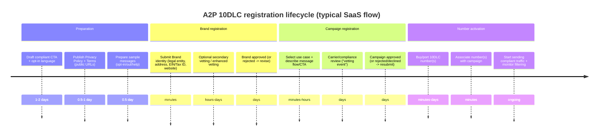
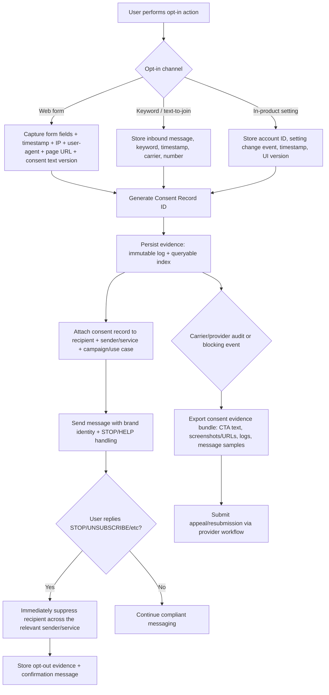

# Choosing an SMS Integration Provider for a Startup SaaS

## Executive summary

The “best” SMS-as-a-service provider depends less on raw per-message price and more on how quickly you can get **A2P/10DLC-compliant** traffic approved, how well the provider helps you **prove consent**, and how predictable your **carrier pass-through + registration fees** are as you scale. U.S. carriers increasingly treat unregistered or poorly registered traffic as high-risk (filtering, surcharges, suspension), so early success typically comes from: (a) a clean consent + opt-out architecture, and (b) a provider whose A2P program is *self-serve, fast to iterate,* and *transparent about fees and rejection loops*. citeturn8search1turn3search9turn3search7

Given your stated priorities (developer experience + rigorous 10DLC/A2P workflow + ability to test now with design partners + cost awareness at scale), the strongest practical conclusion is:

- **Best “keep moving now” path (lowest switching cost):** stay with **Twilio** (you’re already integrated) while tightening your consent evidence workflow and ensuring your A2P 10DLC registration data is “review-proof.” Twilio’s documentation is extensive, it supports ISV-style registration workflows, and it clearly warns that unregistered 10DLC traffic can incur additional carrier fees. citeturn8search1turn8search8turn8search9turn5search36  
- **Best “optimize unit economics without losing developer velocity” alternative:** **entity["company","Telnyx","communications api company"]** is unusually transparent about (1) base message pricing, (2) carrier fees by carrier, and (3) 10DLC registration fees; its developer docs include a “send your first SMS” path explicitly framed as testable *between two Telnyx numbers without carrier registration*, which can help you validate product UX quickly while your real-to-consumer registration completes. citeturn17view0turn6view3turn4search21  
- **Best “carrier-adjacent scale / enterprise routing” option (often contract-led):** **entity["company","Bandwidth","telecom cpaaS company"]** has deep U.S. carrier connectivity and publishes detailed carrier surcharge schedules and TCR-related fee schedules, including appeal and vetting-related fees—useful when you scale or become a true multi-tenant SaaS/ISV. The tradeoff is that self-serve onboarding and pricing can be less “plug-and-play” than developer-first providers, and Bandwidth publicly notes it does not support Sole Proprietor brands/campaigns in its 10DLC fee guidance (which can matter for very small test senders). citeturn14view0turn6view2  
- **Best “strong global enterprise footprint” options (often sales-assisted):** **entity["company","Infobip","croatian cpaaS company"]** and **entity["company","Sinch","swedish cpaaS company"]** are credible global CPaaS vendors, but the day-to-day DX and cost transparency can be more “enterprise procurement” than “startup self-serve.” Sinch’s public SMS pricing is accessible, and its developer docs describe an asynchronous 10DLC registration API that requires polling. Infobip publishes a downloadable North America operator fee schedule (carrier pass-through + TCR-style fees) that supports rigorous cost modeling, but base messaging prices may still be quote/calculator-driven. citeturn20view0turn24view0turn18search7turn26view0turn4search15  
- **Best “registration transparency” among the remaining prioritized vendors:** **entity["company","Vonage","communications api company"]** publishes unusually explicit 10DLC fee tables (brand fees, vetting, monthly campaign fees, and pass-through fees) and lists third-party vetting partners it uses; it also publishes carrier fee schedules by carrier on its SMS pricing pages. citeturn10view0turn9view2  
- **MessageBird / Bird:** the company historically known as **entity["company","MessageBird","cpaaS company"]** operates under the Bird brand and publishes useful guidance on 10DLC “additional costs” including explicit resubmission fees and a 3-month minimum commitment framing; however, some pricing/fee details are presented in ways that may be harder to model programmatically than Telnyx/Twilio/TCR-style tables. citeturn11view1turn18search4  

A rigorous consent + evidence system is not optional. The FCC has adopted significant clarifications around robotext consent and revocation, including rules emphasizing “one-to-one” consent for telemarketing/robotexting contexts and an opt-out revocation rule that became effective April 11, 2025. citeturn3search3turn3search7turn3search15

## Methodology and decision framework

This report prioritizes primary sources: vendor documentation/pricing pages, U.S. regulatory guidance (FCC), and industry best-practice guidance (CTIA). citeturn3search15turn0search3turn8search1turn17view0turn14view0turn9view2turn26view0

Selection criteria are weighted toward what blocks startups in practice:

Implementation and DX  
Provider SDK availability, API clarity, sample apps, webhook ergonomics, and debugging/observability. (Poor DX increases time-to-first-message and the cost of operating messaging at scale.) citeturn4search4turn4search2turn5search1turn4search21turn11view2turn4search15

A2P/10DLC workflow quality  
How quickly you can register a brand/campaign, how clear the required fields are (especially “message flow / call-to-action”), and how iterative the process is when rejected. citeturn8search1turn6view3turn6view2turn10view0turn11view1turn24view0

Consent + evidence readiness  
Whether the vendor provides explicit guidance on what constitutes acceptable opt-in language, opt-out handling, HELP responses, and whether they expect you to maintain easily retrievable “1:1 consent records” for blocking events. citeturn3search9turn3search1turn3search2turn0search3

Cost model clarity (startup now vs scale later)  
Ability to forecast: base per-message price + carrier pass-through fees + recurring campaign fees + one-time registration/vetting fees + number rental fees; and whether carrier-specific fees are public. citeturn16view1turn17view0turn14view1turn9view2turn10view0turn18search7turn20view0

## U.S. compliance reality for SaaS messaging

### The baseline rules you must design for

In the U.S., compliance risk is a combination of law (notably the TCPA regime as interpreted/enforced) and carrier ecosystem rules (10DLC program requirements, filtering, and enforcement). The short version for a SaaS product:

- You must be able to demonstrate that recipients consented to receive the category of messages you send, and that they can revoke consent easily; the FCC’s rules on revocation emphasize consumers may revoke consent “in any reasonable manner,” with an effective date of April 11, 2025 for the relevant TCPA revocation framework. citeturn3search7turn3search15  
- For telemarketing/advertising robotexts, the FCC has also emphasized “one-to-one” consent concepts (each seller/texter must have its own consent) in an order/adoption context that closed common “lead generator loophole” abuse patterns. citeturn3search3  
- Carrier compliance expectations commonly include START/STOP/HELP handling patterns and clear disclosure of brand identity and message frequency; vendors frequently align their guidance with CTIA best practices. citeturn0search3turn3search1turn3search2  
- Carriers increasingly expect **one-recipient-to-one-identified-sender/service** consent records that can be “easily pulled” if a blocking event occurs; Bandwidth’s compliance guidance is explicit about this expectation. citeturn3search9  

### A2P 10DLC registration steps as an operational timeline

Most providers implement the same conceptual chain: register a “brand” (who you are), register a “campaign/use case” (why/how you message, including opt-in/out/help), associate numbers, then send traffic under that campaign identity. citeturn8search1turn6view3turn10view0turn24view0



### Consent evidence handling as a system design requirement

A scalable SaaS must treat consent evidence as “audit data,” not a UI checkbox. This is especially important if you evolve into an ISV model where you register customers or send on behalf of customers. citeturn3search9turn8search8turn3search7



## Provider analysis and comparisons

### Cross-vendor comparison table

The table below summarizes the providers you prioritized plus two notable regional/managed alternatives, using only publicly documented properties where possible; “unspecified” means the vendor does not clearly publish the data publicly or it is not accessible in a stable way. citeturn8search18turn6view3turn6view2turn10view0turn20view0turn18search7turn11view1turn5search2turn18search25

| Provider | Implementation speed & DX | 10DLC/A2P workflow clarity | Consent/evidence support | Pricing transparency | Best recommended use (now vs long-term) |
|---|---|---|---|---|---|
| entity["company","Twilio","communications api company"] | Very strong docs; registration flows documented; broad ecosystem. citeturn8search1turn8search8 | Clear brand/campaign steps; warns of review delays; manual vetting fee noted. citeturn8search1turn8search9 | Strong published best-practice guidance for approvals (opt-in/out/help). citeturn3search4turn8search8 | Publishes base SMS pricing + carrier fee tables + number pricing; 10DLC fees published on product page. citeturn16view1turn8search18 | **Now:** fastest due to existing integration. **Long-term:** viable, but cost optimization may justify alternatives. |
| entity["company","Bandwidth","telecom cpaaS company"] | Good SDKs/samples, but often more “telecom-first.” citeturn4search0turn4search4 | Excellent detail on TCR fee categories + appeal fees; carrier surcharges published with effective dates. citeturn6view2turn14view1 | Strong compliance best practices; explicit “1:1 consent records” expectation. citeturn3search9turn3search1 | Carrier surcharge detail is strong; base messaging rates may be contract/quote-driven. citeturn14view1turn6view2 | **Now:** good if you can engage sales/ops. **Long-term:** strong for scale, multi-tenant, carrier-grade ops. |
| entity["company","Sinch","swedish cpaaS company"] | Public SMS SDKs; modern developer portal; pricing page is accessible. citeturn5search1turn20view0 | Developer docs describe asynchronous 10DLC registration API (polling). citeturn24view0 | Campaign API fields include explicit opt-in/out/help flags and sample messages (structural support). citeturn25search3 | Base SMS/number pricing is public; some 10DLC fee details require other docs/portals. citeturn20view0turn24view0 | **Now:** plausible if you accept enterprise-ish workflow. **Long-term:** strong global vendor; good if you plan omnichannel beyond SMS. |
| entity["company","Vonage","communications api company"] | Solid SDK coverage and code snippets. citeturn4search2turn4search10 | Publishes detailed 10DLC fee table including “vetting event” resubmissions + pass-through fees; names vetting partners. citeturn10view0turn9view0 | Workflow documentation exists; good visibility into pass-through fees and enforcement. citeturn10view0turn9view2 | Carrier fees by carrier are public; base message prices may be account/country-sheet based. citeturn9view2turn32search2 | **Now:** good if you want fee transparency and a stable enterprise vendor. **Long-term:** viable; validate dashboards + deliverability in your vertical. |
| entity["company","MessageBird","cpaaS company"] / entity["company","Bird","messagebird rebrand cpaaS"] | API-oriented; docs include rate limiting and REST usage patterns. citeturn11view2turn11view1 | Documents resubmission constraints (declined vs rejected/suspended) and 3‑month minimum; highlights “ghost campaign” fines. citeturn11view1 | Provides structured guidance for registration artifacts and how costs are computed (base + carrier surcharge). citeturn11view1turn18search20 | Base price depends on plan/country; carrier fees exist but can be harder to scrape/model. citeturn18search4turn11view1 | **Now:** fine if you’re already in the Bird ecosystem. **Long-term:** validate predictability of fees + tooling for SaaS ISV use. |
| entity["company","Telnyx","communications api company"] | Strong developer docs; explicit “send first SMS in 5 minutes” test path. citeturn4search21turn4search5 | Very transparent 10DLC fee + carrier fee breakdown, including non-compliance fines. citeturn6view3turn17view0 | Publishes campaign approval best practices and consent language expectations. citeturn3search2turn3search10 | Publishes base rates + carrier fee tables by carrier. citeturn17view0 | **Now:** excellent for quick dev iteration + cost visibility. **Long-term:** strong if your traffic is U.S.-heavy and cost matters. |
| entity["company","Infobip","croatian cpaaS company"] | Strong API docs + code examples; many SDKs exist. citeturn4search15turn4search23turn4search7 | Operates explicit 10DLC registration program (US Sender Registration app + API) and publishes North America pass-through/fees doc. citeturn18search23turn26view0turn18search7 | Enterprise-grade compliance posture; publishable fees support audit modeling. citeturn18search7turn26view0 | Carrier/TCR pass-through fees very transparent via downloadable fee sheet; base SMS pricing may be calculator-based. citeturn18search7turn18search2 | **Now:** good if you already need global reach. **Long-term:** excellent for multinational scale + direct connections. |
| entity["company","Plivo","cloud communications company"] (notable alternative) | Solid developer positioning; supports A2P 10DLC. citeturn5search2turn5search22 | States unregistered long-code traffic will not be delivered; notes manual review time 1–2 weeks. citeturn5search2 | Registration guidance exists; ensure your evidence is strong to avoid long approval loops. citeturn5search2 | Fees referenced but full modeling may require multiple price pages. citeturn5search6turn5search2 | **Now:** reasonable alternative. **Long-term:** validate throughput/compliance support depth for SaaS multi-tenancy. |
| entity["company","MessageMedia","australian messaging company"] (regional/managed) | More “messaging platform” oriented; pricing is more packaged. citeturn18search25turn18search9 | Publishes a carrier fee schedule page for USA/Canada; more managed model. citeturn18search9 | Helpful if you want operational help vs building everything. citeturn18search25 | Number fees are materially higher than developer-first CPaaS in many cases. citeturn18search25 | **Now:** good if you want managed onboarding. **Long-term:** can be expensive vs API-first providers. |

### Provider-by-provider findings

Below, each provider is evaluated on the specific items you requested: overview, 10DLC/A2P workflow, consent evidence, developer experience, pricing elements, scalability, limitations, and best-fit recommendation. Where a fee is carrier/TCR-driven, providers often pass-through at cost or with markup; the operational difference is how well they handle iteration, rejections, and reporting.

**Twilio** (your current provider)  
Overview: Mature CPaaS with broad product surface area; A2P 10DLC is deeply integrated into its compliance tooling and console. citeturn8search1turn8search8  
10DLC/A2P workflow: Twilio’s docs describe A2P 10DLC as requiring two main components—Brand + Campaign—and provide different guides for Direct, ISV, and Sole Proprietor registration types. It also warns that campaign reviews can take 10–15 days during high submission periods and that you can only send compliant A2P messages once approved. citeturn8search1turn8search9  
Consent/evidence: Twilio publishes approval best practices that emphasize opt-in consent as part of the “message flow / call-to-action” requirement and expects opt-out methods and HELP handling; it provides “gather required business info” documentation that maps directly to registration parameters. citeturn3search4turn8search8  
Developer experience: Strong documentation and APIs; ISV workflows are explicitly supported via APIs in addition to console workflows. citeturn8search1turn8search8  
Pricing: Twilio publishes (a) base long-code/toll-free SMS volume prices (e.g., $0.0083/segment in the first tier), (b) carrier fees by carrier, and (c) long-code number monthly pricing (e.g., $1.15/month per long code in the first tier). Twilio also publishes 10DLC registration pricing by registration tier on its 10DLC product page (e.g., standard registration: $44 one-time brand registration + $15 per campaign vetting + $1.50–$10 monthly per campaign; sole proprietor: $4 one-time brand + $15 per campaign + $2/month per campaign). citeturn16view1turn8search18turn16view0  
Scalability: Brand types and daily volume thresholds are documented (e.g., differentiated tiers by daily message volumes and trust score). citeturn8search1  
Known limitations: Some operational friction comes from review delays and resubmission costs for failed vetting; also, Twilio states A2P 10DLC registration requires a paid account. citeturn8search1turn8search19turn8search9  
Recommended use-case: Best for immediate testing because you already run it; you can improve cost later by abstracting providers.

**Telnyx**  
Overview: Developer-first communications platform with unusually transparent U.S. messaging economics. citeturn17view0turn6view3  
10DLC/A2P workflow: Telnyx breaks out standard registration fees (brand application fee, campaign review fee, monthly campaign fees billed for an initial three months) and explicitly enumerates carrier fees for registered vs unregistered traffic and non-compliance fines. citeturn6view3  
Consent/evidence: Telnyx publishes campaign approval best practices and compliance requirements, including expectations around opt-in language specificity, inclusion of Privacy Policy and Terms links, and inclusion of opt-out language in sample messages. citeturn3search2turn3search10turn3search14  
Developer experience: Telnyx provides “Send your first SMS” documentation and states you can test between two Telnyx numbers with no carrier registration required (useful for design-partner UX testing while A2P registration is in flight). Telnyx also documents message detail records for delivery tracking. citeturn4search21turn4search37  
Pricing: Telnyx publishes base pay-as-you-go rates for local/10DLC SMS ($0.004 per message part outbound and inbound) plus explicit carrier-fee tables (e.g., outbound carrier fees: AT&T $0.003, T-Mobile $0.0045, Verizon $0.004; and inbound carrier fee cases such as T-Mobile inbound $0.0025). citeturn17view0  
Scalability: Telnyx publishes automatic discounts at very high monthly volumes and calls out carrier special review concepts for very large daily volumes. citeturn17view0turn6view3  
Known limitations: Like all vendors, carrier-driven non-compliance fines can be substantial; Telnyx enumerates these pass-through fines, which is transparency-positive but operationally demands strong compliance discipline. citeturn6view3  
Recommended use-case: Strong candidate if you want to optimize cost while keeping a developer-centric workflow.

**Bandwidth**  
Overview: Carrier-adjacent CPaaS with a heavy emphasis on compliance and transparent pass-through fee categorization. citeturn6view2turn14view0  
10DLC/A2P workflow: Bandwidth’s 10DLC fees page enumerates fee classes (CSP registration, brand registration, optional vetting tiers, appeals, campaign monthly fees by use case), and explicitly lists appeal fees (e.g., vetting appeal fees, authentication plus verification appeal). citeturn6view2  
Consent/evidence: Bandwidth’s campaign registration best practices and vetting tips emphasize the “call to action / message flow” field and the need to explain opt-in method and where it is advertised; their compliance best practices explicitly state recipients must opt into a specific service and that carriers expect 1:1 consent records retrievable during blocking events. citeturn3search1turn3search5turn3search9  
Developer experience: Bandwidth publishes SDK documentation (e.g., Node SDK) and official sample apps across many languages. citeturn4search0turn4search4  
Pricing: Bandwidth publishes carrier surcharge tables with effective dates, including updated registered 10DLC surcharges (e.g., new AT&T registered SMS surcharge $0.0035 inbound/outbound effective 4/1/2026; T‑Mobile registered outbound $0.0045 and inbound $0.0025 effective 1/19/2026; Verizon registered outbound $0.0040 effective 6/1/2025). citeturn14view1  
Scalability: Strong for high-volume and multi-tenant models, particularly when you want carrier-grade operations and well-defined compliance processes. citeturn6view2turn14view1  
Known limitations: Bandwidth states it does not currently support Sole Proprietor brands or campaigns (in its fee guidance), which can matter if you expect many micro-senders in your SaaS to register as sole proprietors. citeturn6view2  
Recommended use-case: Particularly strong if you will become an ISV platform with many downstream customers and need robust compliance operations.

**Vonage (Nexmo)**  
Overview: Global CPaaS vendor with unusually explicit public documentation of A2P 10DLC fee mechanics. citeturn10view0turn4search2  
10DLC/A2P workflow: Vonage’s 10DLC pricing page explicitly categorizes one-time brand fees, brand vetting options, a campaign vetting fee per “vetting event,” monthly campaign subscription fees by use case, and pass-through tables for 10DLC-compliant vs unregistered traffic. It also names vetting partners such as **entity["company","Aegis Mobile","10dlc vetting provider"]**, **entity["company","WMC Global","digital trust company"]**, and **entity["company","Campaign Verify","10dlc vetting provider"]**. citeturn9view0turn10view0  
Consent/evidence: Vonage’s documentation frames the program as carrier-regulated and notes campaigns can be suspended or blocked for non-compliance; operationally, you should assume your CTA and consent evidence must stand up to review and re-review. citeturn10view0  
Developer experience: Vonage publishes server SDKs across major languages and provides many code snippets for SMS send/receive. citeturn4search2turn4search10  
Pricing: Vonage’s SMS pricing page publishes “long code additional carrier fees” by carrier (e.g., Verizon send $0.004, T‑Mobile send $0.0045 for registered 10DLC traffic, AT&T send $0.003 and receive $0.003). Vonage’s A2P 10DLC page publishes monthly campaign fees (e.g., many standard use cases $10/month; low-volume mixed $1.50/month; sole proprietor $2/month) and a campaign vetting fee of $15 per vetting event with additional charges for re-review events. citeturn9view2turn10view0  
Scalability: Strong; these tables suggest operational maturity for large senders, including special review references. citeturn10view0  
Known limitations: The combination of (a) partner-based vetting, (b) repeated “vetting event” fees, and (c) multiple pass-through fee components can create higher operational overhead unless you have strong internal compliance workflows. citeturn10view0  
Recommended use-case: Good if you want fee transparency and an enterprise vendor; validate UX of registration tooling and support responsiveness for your startup pace.

**MessageBird / Bird**  
Overview: International CPaaS and messaging platform vendor operating under Bird branding, with a REST API and rate limits documented in its developer portal. citeturn11view2turn18search4  
10DLC/A2P workflow: Bird’s docs publish additional cost structures: brand registration ($4), resubmission fees, secondary vetting fee ($40 optional), campaign registration fee ($15), resubmission fees, and an explicit “declined vs rejected/suspended” resubmission rule. It also describes a 3-month commitment structure for use case registration fees and references a $250 “ghost campaign” fine if a campaign has no traffic for 60 days. citeturn11view1  
Consent/evidence: Bird frames total message cost as “base Bird message rate + surcharge to destination carrier,” implying you must know both your program registration and your carrier fee environment to model cost. citeturn11view1turn18search20  
Developer experience: Straightforward REST API and documentation; ensure you validate webhook handling and deliverability tooling for your product needs. citeturn11view2turn5search0  
Pricing: Bird’s SMS pricing is country/plan-dependent; it flags additional carrier fees for U.S./Canada. citeturn18search4turn18search0  
Scalability: Designed for omnichannel; but the “campaign inactivity/ghost” fine means operational hygiene (auto-deactivation) matters. citeturn11view1  
Known limitations: Some fee data is less straightforward to model automatically than vendors that publish stable CSV-like tables; verify programmatic access for billing exports and campaign lifecycle management. citeturn11view1turn18search4  
Recommended use-case: Consider if you want Bird’s broader CRM/omnichannel platform, not solely an SMS transport layer.

**Sinch**  
Overview: Global CPaaS with public SMS pricing and developer documentation, including SDKs and an explicit 10DLC Brand/Campaign Registration API. citeturn20view0turn5search1turn24view0  
10DLC/A2P workflow: Sinch’s developer docs describe 10DLC registration as asynchronous and recommend polling until “Approved” or “Rejected.” It also describes the registration sequence (submit brand → poll → get TCR brand ID → qualify campaign → submit campaign → poll → get TCR campaign ID). citeturn24view0  
Consent/evidence: Sinch’s campaign API schema includes explicit fields that force you to think about opt-in/out/help support and sample messages (e.g., `subscriberOptIn`, `subscriberOptOut`, `subscriberHelp`, `optInMessage`, `stopMessage`, `helpMessage`, and multiple samples). This is structurally supportive for building a compliance-grade SaaS workflow. citeturn25search3turn25search0  
Developer experience: Sinch publishes SDKs and emphasizes standardized patterns. citeturn5search1turn5search13  
Pricing: Sinch’s SMS pricing page shows 10DLC SMS send/receive at $0.0078 each (carrier fees apply) and number pricing that includes a $1.00/month fee and $1.00 setup fee for 10DLC numbers. citeturn20view0  
Known limitations: Some detailed 10DLC fee schedules may be gated behind JS-based community pages or partner portals; ensure you can access full fee mechanics and resubmission/appeal pathways before committing. citeturn20view0turn24view0  
Recommended use-case: Good if you anticipate expanding beyond SMS to other channels and can accept enterprise-style processes.

**Infobip**  
Overview: Large global CPaaS with extensive API documentation, code examples, and SDK ecosystem. citeturn4search15turn4search23turn4search7  
10DLC/A2P workflow: Infobip’s public documentation describes using a “US Sender Registration app” and a “Number Registration API” to register brands, and it publishes a “North America pass-through fees” policy page providing a downloadable operator fee schedule. citeturn18search23turn26view0turn18search7  
Consent/evidence: Infobip’s enterprise posture means you should assume strong documentation and audit trails are expected; use their downloadable fee/charge schedules to align your internal compliance and billing models. citeturn18search7turn26view0  
Pricing: Infobip’s downloadable North America operator fee sheet includes carrier pass-through fees by carrier for 10DLC and 10DLC fee schedules (brand registration, Authentication+, campaign fees, vetting tiers). citeturn18search7  
Scalability: Strong global scale; credible for multinational routing and enterprise-grade throughput. citeturn18search29  
Known limitations: Base SMS unit prices may be less transparent than the pass-through fees; validate your effective blended rate with your traffic distribution and use case. citeturn18search2turn18search7  
Recommended use-case: Strong if you need global coverage and want a rigorous fee framework; confirm startup-friendly onboarding/support expectations.

### Partner and “registration concierge” options

If your team wants to reduce internal time spent on 10DLC rejections and evidence preparation, there are three classes of partners:

Provider professional services  
Twilio explicitly offers professional services for A2P 10DLC help (useful if you want to keep Twilio but reduce internal iteration time). citeturn8search1

Vetting ecosystem providers  
Vonage’s documentation references third-party vetting partners (Aegis, WMC, Campaign Verify). While not “consultants” in the classic sense, these organizations show up in the ecosystem and can be part of appeals/vetting workflows depending on vendor and campaign type. citeturn9view0turn10view0

10DLC-focused providers/consultancies  
A notable example is **entity["company","Telgorithm","a2p messaging provider"]**, which positions itself around compliance guidance and automation for registration and deliverability (evaluate carefully, but it is explicitly focused on the pain points you described). citeturn5search3turn5search32  

## Pricing and cost modeling

### What you should model

A realistic U.S. SMS total cost should be modeled as:

Total monthly cost  
= (Outbound segments × (Vendor base outbound rate + Carrier pass-through per carrier))  
+ (Inbound segments × (Vendor base inbound rate + Carrier inbound pass-through per carrier))  
+ (Monthly campaign fees by use case × number of campaigns)  
+ (Monthly number rental fees × number of numbers)  
+ amortized one-time fees (brand registration + vetting + campaign vetting/resubmissions)  
+ operational risk buffer (failed vetting resubmissions; fines if you mis-declare use case; inactivity/ghost campaign fines in some ecosystems). citeturn16view1turn6view3turn14view1turn10view0turn11view1turn26view0

### Carrier-specific fee table for major U.S. carriers

The table below compares publicly available carrier pass-through fees (or “carrier fees / surcharges”) for registered 10DLC traffic terminating to the major U.S. carriers. Where vendors publish only the pass-through and not the base price, the “base” column is marked unspecified.

Carrier names are shown once here for clarity: **entity["company","AT&T","us telecom carrier"]**, **entity["company","Verizon","us telecom carrier"]**, **entity["company","T-Mobile","us telecom carrier"]**. citeturn16view0turn14view1turn17view0turn9view2turn18search7

| Vendor context | Published base outbound SMS | AT&T carrier fee (outbound) | T‑Mobile carrier fee (outbound) | Verizon carrier fee (outbound) | Notes |
|---|---:|---:|---:|---:|---|
| Twilio (long code) | $0.0083/segment (tier 1) citeturn16view1 | $0.003 citeturn16view0 | $0.0045 citeturn16view0 | $0.004 citeturn16view0 | Twilio publishes separate carrier fee tables and number pricing. citeturn16view1turn16view0 |
| Telnyx (local incl. 10DLC) | $0.004/message part + carrier fee citeturn17view0 | $0.003 citeturn17view0 | $0.0045 citeturn17view0 | $0.004 citeturn17view0 | Telnyx explicitly prices as base + carrier fee. citeturn17view0 |
| Bandwidth (carrier surcharges) | Unspecified (often contract) | $0.0035 (registered, effective 4/1/2026) citeturn14view1 | $0.0045 outbound (registered, effective 1/19/2026) citeturn14view1 | $0.0040 outbound (registered) citeturn14view1 | Bandwidth surcharge docs include effective dates; treat as pass-through. citeturn14view1 |
| Vonage (long code additional carrier fees) | Unspecified on this page | $0.003 citeturn9view2 | $0.0045 (registered 10DLC traffic) citeturn9view2 | $0.004 citeturn9view2 | Vonage also publishes a 10DLC fee schedule and vetting-event approach. citeturn10view0turn9view2 |
| Sinch | $0.0078 outbound (carrier fees apply) citeturn20view0 | Carrier fee applies (not enumerated on pricing page) | Carrier fee applies (not enumerated on pricing page) | Carrier fee applies (not enumerated on pricing page) | Use-case/campaign fee amounts can be returned by Sinch campaign qualification APIs (`monthlyFee`, `setupFee`). citeturn25search0turn24view0 |
| Infobip (operator fee schedule) | Unspecified (base depends on plan/route) | $0.0030 and $0.0035 effective April 1 (per schedule) citeturn18search7 | $0.0045 outbound, $0.0025 inbound (per schedule) citeturn18search7 | $0.004 outbound (per schedule) citeturn18search7 | Infobip publishes a downloadable operator fee sheet via their pass-through fee policy page. citeturn26view0turn18search7 |

### Registration and campaign fee benchmarks

While every vendor’s UX differs, many fee components are fundamentally TCR/carrier-driven and converge around similar numbers:

- Campaign vetting/review fees cluster around **$15 per submission / vetting event** and can repeat on resubmission. citeturn6view3turn10view0turn11view1turn26view0  
- Monthly campaign fees commonly range from **$1.50 (low volume mixed) to $10 (standard use cases)**, with specialty categories (e.g., agents/franchises) higher in some schedules. citeturn6view3turn10view0turn11view1turn26view0  
- Optional secondary vetting/enhanced vetting is commonly a separate pass-through cost (e.g., Bird shows $40; Bandwidth and Vonage publish wider vetting tiers; Infobip’s sheet includes standard/enhanced-style fee tiers). citeturn11view1turn6view2turn10view0turn18search7  

## Implementation checklist for immediate testing and a migration strategy from Twilio

### Immediate implementation checklist for design-partner testing

This checklist assumes you want to begin testing flows now while doing registration correctly (so your test doesn’t become a compliance dead-end):

Product and legal surface (must be ready before registration submissions)  
You should publish a publicly accessible Privacy Policy and Terms and ensure your call-to-action text includes SMS-specific opt-in language, message frequency disclosure, “Msg & data rates may apply,” and opt-out/HELP instructions—because vendors and carriers commonly require these elements in campaign submissions and sample messages. citeturn3search25turn3search10turn3search1turn0search3

Consent evidence system (build once; reuse across providers)  
Implement the consent evidence flowchart above: store opt-in event metadata (timestamp, method, source URL/screen, consent language version) and store opt-out events and suppression decisions. Bandwidth explicitly warns carriers expect 1:1 consent records retrievable for blocking events. citeturn3search9turn3search7

Message handling  
Support STOP (and synonyms) and HELP. Given FCC revocation guidance emphasizing “any reasonable manner,” treat opt-out as a system-wide event, not only STOP replies. citeturn3search7turn3search15

Provider setup  
- Stand up a dedicated “messaging service” abstraction in your app so you can swap providers without rewriting business logic.  
- For early UX testing that doesn’t depend on real carrier delivery, consider provider-supported internal testing paths (Telnyx explicitly documents testing between two Telnyx numbers without carrier registration). citeturn4search21

Registration submission package (what to collect internally)  
- Brand identity (legal name, address, tax ID/EIN where applicable, website). citeturn8search8turn24view0  
- Campaign use case selection + explicit message flow/CTA. citeturn8search1turn3search5  
- Minimum 2–4 sample messages including brand identity and opt-out/help language (best practice across vendor guidance). citeturn3search25turn3search2turn3search12  

Operational readiness  
Expect that rejections are normal; design your process so each iteration is low-friction, since several providers charge per vetting/resubmission event. citeturn10view0turn11view1turn6view3turn6view2  

### Migration strategy from Twilio if cost or control becomes decisive

A safe migration does not start with “switch the API endpoint.” It starts with isolating the compliance and messaging primitives so you can run **dual providers** during validation.

Stepwise approach

Architecture first: provider abstraction + idempotency  
Implement an internal “Messaging Provider Interface” (send, receive webhook validate, delivery status, opt-out update, number management). This allows dual routing (Twilio + alternative) and rollback.

Parallel compliance normalization  
Keep your consent evidence store provider-agnostic. Your registration artifacts (CTA text, screenshots/URLs, sample messages) should be reusable across vendors because the underlying carrier requirements are similar across ecosystems. citeturn3search9turn8search8turn6view3turn10view0

Dual-delivery pilot with design partners  
- Keep Twilio as baseline delivery.  
- Add a second provider for a controlled subset of messages/users.  
- Compare deliverability proxies (delivery receipts, complaint rates, opt-out rates, latency).

Registration and number strategy  
If you need to keep existing phone numbers, plan for number porting and carefully map campaigns to numbers in the new provider (vendors commonly require explicit association of numbers with campaign IDs). citeturn8search5turn24view0turn6view3  

Cutover and monitoring  
Once the parallel pilot shows stable delivery and your support team can handle provider-specific failure modes, gradually shift traffic weight.

### Direct links to primary sources

```text
Regulatory / best practice
- FCC consumer guide: Stop unwanted robocalls and texts: https://www.fcc.gov/consumers/guides/stop-unwanted-robocalls-and-texts
- FCC consent revocation rule effective date notice (robotexts): https://www.fcc.gov/document/tcpa-rules-revoking-consent-unwanted-robocallsrobotexts
- FCC “one-to-one consent” order PDF (Dec 23, 2024): https://docs.fcc.gov/public/attachments/DOC-408396A1.pdf
- CTIA Messaging Principles & Best Practices (search result reference): (use the CTIA PDF found via CTIA’s site/search portals)

Vendor registration + pricing anchors
- Twilio A2P 10DLC overview: https://www.twilio.com/docs/messaging/compliance/a2p-10dlc
- Twilio 10DLC product pricing breakdown: https://www.twilio.com/en-us/phone-numbers/a2p-10dlc
- Twilio US SMS pricing + carrier fees tables: https://www.twilio.com/en-us/sms/pricing/us
- Bandwidth 10DLC fees: https://www.bandwidth.com/support/en/articles/12823086-10dlc-fees
- Bandwidth carrier surcharges: https://www.bandwidth.com/support/en/articles/12823178-carrier-surcharges
- Telnyx messaging pricing (base + carrier fees): https://telnyx.com/pricing/messaging
- Telnyx 10DLC fees & charges: https://support.telnyx.com/en/articles/5634625-10dlc-fees-and-charges
- Vonage 10DLC pricing and fees: https://api.support.vonage.com/hc/en-us/articles/360058158511-10-DLC-Pricing-and-Fees
- Vonage SMS pricing (carrier fees table): https://www.vonage.com/communications-apis/sms/pricing/
- Sinch SMS pricing: https://sinch.com/pricing/sms/
- Sinch 10DLC registration API docs: https://developers.sinch.com/docs/10dlc-registration/api-reference/10dlc-registration/10dlc-brand-registration
- Infobip North America pass-through fees policy page: https://www.infobip.com/policies/north-america-pass-through-fees
```

